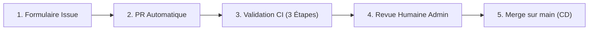

# Ardian — Entitlement Management Entra ID

> Automatisation GitOps de l'Entitlement Management Azure AD / Entra ID via Terraform et GitHub Actions.

---

## 🧭 Que souhaitez-vous faire ?

Choisissez l'action souhaitée ci-dessous pour accéder directement au formulaire de demande :

| Scénario & Action | Profil | Description | Accès direct |
|:---|:---:|:---|:---:|
| ✏️ **Modifier une application** | 👤 Utilisateur | Mettre à jour les accès ou rôles d'une application existante | [**Lancer la modification ➔**](https://github.com/MonEntreprise2-0/Test-EntraID/issues/new?template=01-user-modify-app.yml) |
| 🆕 **Créer une application** | 🛡️ Admin | Déclarer une nouvelle application et assigner la Team GitHub Owner | [**Lancer la création ➔**](https://github.com/MonEntreprise2-0/Test-EntraID/issues/new?template=02-admin-create-app.yml) |
| ⚡ **Modification en masse** | 🛡️ Admin | Mettre à jour plusieurs applications existantes via une archive ZIP | [**Lancer l'import ZIP ➔**](https://github.com/MonEntreprise2-0/Test-EntraID/issues/new?template=03-admin-bulk-modify.yml) |
| 🔄 **Import depuis Entra ID** | 🛡️ Admin | Rétro-ingénierie : exporter l'état réel d'Entra ID vers GitHub | [**Lancer l'import Entra ID ➔**](https://github.com/MonEntreprise2-0/Test-EntraID/issues/new?template=04-admin-import-entra.yml) |

---

## 🎯 Objectif de la plateforme

Ce repository implémente une chaîne CI/CD déclarative où chaque application possède son dossier et son fichier YAML dédié pour piloter les ressources d'Entitlement Management dans Entra ID :
- **Catalogues** (`azuread_access_package_catalog`) — *Création automatique ou consommation de catalogues existants (Smart Discovery)*
- **Access Packages** (`azuread_access_package`) — *Bundles de rôles demandables dans MyAccess selon la formule standard*
- **Politiques d'assignation** (`azuread_access_package_assignment_policy`) — *Workflows d'approbation et durées d'assignation*

---

## 📐 Principes d'architecture

| Principe | Description |
|---|---|
| **Entra ID = SSoT** | Entra ID est la Source Unique de Vérité. Le repo stocke les intentions de déploiement et se réconcilie en continu. |
| **1 Répertoire = 1 Fichier** | Chaque application possède son propre dossier : `declaration/<nomapplication>/<nomapplication>.yaml`. |
| **Mode Consommateur** | Terraform ne crée pas les groupes de sécurité ni les applications sous-jacentes. Il les interroge via des blocs `data`. |
| **Smart Discovery** | Les catalogues existants dans Entra ID sont détectés automatiquement sans paramètre technique obligatoire. |

---

## 🚀 Fonctionnement du cycle de vie CI/CD



1. **Demande** : L'utilisateur ou l'administrateur soumet un formulaire d'Issue selon son profil.
2. **Pull Request automatique** : Le workflow route la demande, crée la branche et ouvre une PR dédiée.
3. **Validation CI à 3 étapes** :
   - *Étape 1* : Syntaxe et conformité au schéma contractuel YAML.
   - *Étape 2* : Détection des ressources dans Entra ID (bloquant strict si ressource manquante, relance via "Re-run jobs").
   - *Étape 3* : Validation humaine (Approbation formelle d'un administrateur).
4. **Approbation & Merge** : Après validation, le merge déclenche l'application automatique dans Entra ID et met à jour `CODEOWNERS`.

---

## 📁 Structure du repository

```
├── .github/
│   ├── CODEOWNERS        # Matrice des équipes propriétaires par application
│   ├── ISSUE_TEMPLATE/   # Formulaires des 4 scénarios (A: Modif, B: Création, C: Masse ZIP, D: Import Entra)
│   ├── scripts/          # Moteur Python (Parsing, validation schéma, discovery, reverse engineering, zip)
│   └── workflows/        # Workflows CI/CD (01-issue-to-pr, 02-download, 03-ci-3-etapes, 04-cd-apply)
├── declaration/          # Référentiel déclaratif (1 dossier = 1 fichier YAML par application)
│   ├── _example/         # Modèle de référence documenté
│   └── <nomapplication>/ # Dossier de l'application contenant <nomapplication>.yaml
├── tools/                # Outillage local pour les administrateurs (bulk_yaml_editor.py)
├── terraform/            # Code Terraform (IaC) piloté dynamiquement par les YAMLs
├── schemas/              # Schémas JSON de validation de syntaxe
└── docs/                 # Guides d'architecture et de gouvernance
```

## 📋 Documentation et Guides d'Architecture

- 🗂️ [**Structure & Cartographie Cible du Référentiel GitHub**](docs/repo_git.md)
- 🔄 [**Plan d'Implémentation Technique : Récupération de l'Existant (Reverse Engineering)**](docs/scenario_de_recuperation_existant.md)
- ⚡ [**HLD Modification en Masse (Import ZIP & Double Validation)**](docs/MODIFICATION_DE_MASSE.md)
- 🚀 [Spécifications Techniques V2 (Orientations Validées — Run Cible)](docs/SPECIFICATIONS_V2.md)
- 📘 [Document de Stratégie d'Implémentation (Design Doc — Modèle de Run)](docs/Design-Doc-Strategie-Implementation-Ardian.md)
- 📐 [Document d'Architecture Technique (HLD Global)](docs/HLD_STRATEGIE_IMPLEMENTATION.md)
- 📝 [Guide de rédaction YAML d'exemple](declaration/_example/_example.yaml)
- ⚙️ [Documentation des pré-requis IAM et Azure](docs/PREREQUISITES.md)
- 📖 [Guide Opérationnel](docs/OPERATIONAL_GUIDE.md)