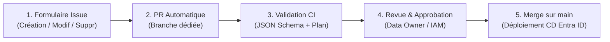

# Ardian — Entitlement Management Entra ID

> Automatisation GitOps de l'Entitlement Management Azure AD / Entra ID via Terraform et GitHub Actions.

---

## 🧭 Que souhaitez-vous faire ?

Choisissez l'action souhaitée ci-dessous pour accéder directement au formulaire de demande :

| Action | Description | Accès direct |
|:---|:---|:---:|
| 🆕 **Créer un Access Package** | Déclarer une nouvelle application avec ses ressources, rôles et politiques d'accès | [**Lancer la création ➔**](https://github.com/Orlaine/Test-EntraID/issues/new?template=01-create-access-package.yml) |
| ✏️ **Modifier un Access Package** | Mettre à jour les accès, ajouter des groupes ou modifier les politiques d'une application existante | [**Lancer la modification ➔**](https://github.com/Orlaine/Test-EntraID/issues/new?template=02-modify-access-package.yml) |
| 🗑️ **Supprimer un Access Package** | Retirer définitivement une application et ses paquets d'accès d'Entra ID | [**Lancer la suppression ➔**](https://github.com/Orlaine/Test-EntraID/issues/new?template=03-delete-access-package.yml) |

---

## 🎯 Objectif de la plateforme

Ce repository implémente une chaîne CI/CD déclarative où un fichier YAML par application pilote automatiquement les ressources d'Entitlement Management dans Entra ID :
- **Catalogues** (`azuread_access_package_catalog`) — *Création automatique ou consommation de catalogues existants (Smart Discovery)*
- **Access Packages** (`azuread_access_package`) — *Bundles de rôles demandables dans MyAccess*
- **Politiques d'assignation** (`azuread_access_package_assignment_policy`) — *Workflows d'approbation, durée et revues d'accès*

---

## 📐 Principes d'architecture

| Principe | Description |
|---|---|
| **Entra ID = SSoT** | Entra ID est la Source Unique de Vérité. Le repo stocke les intentions de déploiement et se réconcilie en continu. |
| **1 App = 1 YAML** | Chaque application possède son propre fichier déclaratif dans `declarations/apps/<nom-app>.yaml`. |
| **Mode Consommateur** | Terraform ne crée pas les groupes de sécurité ni les applications sous-jacentes. Il les interroge via des blocs `data`. |
| **Smart Discovery** | Les catalogues existants dans Entra ID sont détectés automatiquement sans paramètre technique obligatoire. |

---

## 🚀 Fonctionnement du cycle de vie CI/CD



1. **Demande** : L'utilisateur soumet un formulaire d'Issue (avec glisser-déposer du fichier YAML ou sélection de fichier).
2. **Pull Request automatique** : Un workflow génère une branche et ouvre une PR dédiée.
3. **Validation & Plan** : La CI valide la conformité du schéma et affiche un compte-rendu lisible des changements prévus dans Entra ID.
4. **Approbation & Merge** : Après validation des approbateurs, le merge déclenche l'application automatique dans Entra ID.

---

## 📁 Structure du repository

```
├── .github/
│   ├── ISSUE_TEMPLATE/   # Formulaires d'Issues (Création, Modification, Suppression)
│   ├── scripts/          # Scripts d'automatisation (Parsing, Smart Discovery)
│   └── workflows/        # Workflows CI/CD (Issue->PR, Download, Plan, Apply)
├── declarations/apps/    # Fichiers YAML déclaratifs (1 par application)
│   └── _example.yaml     # Fichier d'exemple documenté et guide de référence
├── terraform/            # Code Terraform (IaC) piloté dynamiquement par les YAMLs
├── schemas/              # Schémas JSON de validation de syntaxe
└── docs/                 # Guides d'architecture et de pré-requis
```

## 📋 Documentation et Guides d'Architecture

- 🗂️ [**Structure & Cartographie Cible du Référentiel GitHub**](docs/repo_git.md)
- 🔄 [**Plan d'Implémentation Technique : Récupération de l'Existant (Reverse Engineering)**](docs/scenario_de_recuperation_existant.md)
- ⚡ [**HLD Modification en Masse (Import ZIP & Double Validation)**](docs/MODIFICATION_DE_MASSE.md)
- 🚀 [Spécifications Techniques V2 (Orientations Validées — Run Cible)](docs/SPECIFICATIONS_V2.md)
- 📘 [Document de Stratégie d'Implémentation (Design Doc — Modèle de Run)](docs/Design-Doc-Strategie-Implementation-Ardian.md)
- 📐 [Document d'Architecture Technique (HLD Global)](docs/HLD_STRATEGIE_IMPLEMENTATION.md)
- 📝 [Guide de rédaction YAML d'exemple](declarations/apps/_example.yaml)
- ⚙️ [Documentation des pré-requis IAM et Azure](docs/PREREQUISITES.md)
- 📖 [Guide Opérationnel](docs/OPERATIONAL_GUIDE.md)