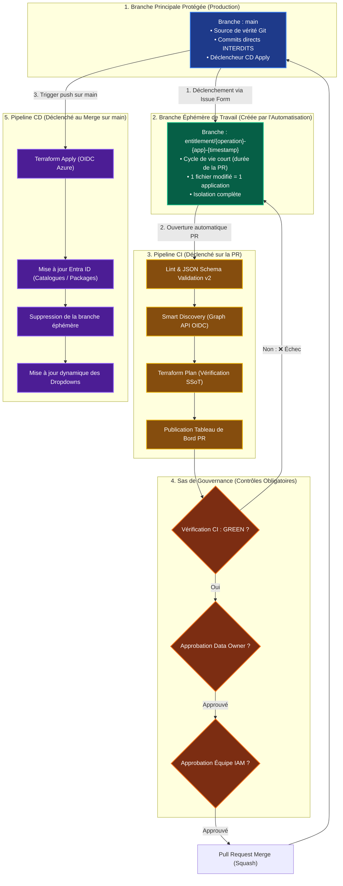

# Architecture Technique & Gitflow — GitOps Entitlement Management

Ce document décrit les principes d'architecture, la conception technique et le modèle de branching Gitflow de la solution d'industrialisation du run d'Entitlement Management pour Ardian.

---

## 1. 📐 Principes fondateurs

- **Entra ID = Source Unique de Vérité (SSoT)** : Le repo GitHub contient les *intentions* de configuration. Entra ID contient la vérité absolue.
- **1 Application = 1 Catalogue = 1 Fichier YAML** : Isolation complète des droits par application dans `declarations/apps/<nom-app>.yaml`.
- **Mode Consommateur Strict** : Terraform ne crée JAMAIS de groupe ou d'application Entra ID. Toutes les dépendances sont lues via des blocs `data`. Si un groupe manque dans Entra ID, `terraform plan` échoue.
- **Authentification Zero-Secret (OIDC)** : Fédération d'identité Azure AD / GitHub Actions (*Workload Identity Federation*). Aucun mot de passe ou secret statique stocké.

---

## 2. 🔄 Diagramme Fonctionnel du Gitflow (Cycle de Vie & Déclencheurs)

Ce diagramme détaille les transitions, les conditions de passage et les interactions entre les branches :

---

## 3. 🛡️ Règles de Gouvernance des Branches

| Composant | Règle / Caractéristique | Justification & Sécurité |
|:---|:---|:---|
| **Branche `main`** | • **Branch Protection activée** • Push direct interdit à tous (y compris administrateurs) • Merge uniquement via Pull Request signée | Garantit qu'aucun changement ne contourne la validation CI ni la double approbation humaine. |
| **Branches de travail** | • Nomenclature : `entitlement/{operation}-{app}-{timestamp}` • Création automatique par le bot de CI • Suppression automatique après merge | Évite les conflits de nommage et garantit un environnement propre pour chaque opération. |
| **Statuts CI pré-requis** | • Validation syntaxique & schéma JSON valide • Succès du `terraform plan` • Détection de 0 asset bloquant non résolu | Empêche tout merge si une ressource Entra ID déclarée est absente de l'annuaire. |
| **Stratégie de Merge** | **Squash and Merge** (ou Rebase) | Maintient un historique linéaire et lisible sur `main` (1 commit = 1 déploiement applicatif traçable). |

---

## 4. 🚀 Description des Pipelines CI/CD

1. **Utilisateur / Métier** : Ouvre une demande via les formulaires d'Issues dédiés (Création, Modification, Suppression).
2. **Workflow `01-issue-to-pr.yml`** : Parse l'Issue via `parse-issue-body.py`, vérifie l'anti-collision, crée la branche éphémère et ouvre automatiquement la Pull Request.
3. **Workflow `03-ci-validate-and-plan.yml`** : Valide la conformité du fichier avec le schéma JSON v2, lance la Smart Discovery pour détecter les catalogues et ressources existants, puis exécute `terraform plan` via OIDC pour valider les dépendances SSoT dans Entra ID. Restitue le plan dans un commentaire formaté.
4. **Sas d'Approbation** : Le Data Owner métier et le responsable IAM / Sécurité Cloud examinent le plan d'impact et approuvent formellement la PR.
5. **Workflow `04-cd-apply.yml`** : Au merge sur `main`, exécute `terraform apply -auto-approve` pour déployer dans Entra ID, met à jour les formulaires de sélection et supprime la branche de travail.
