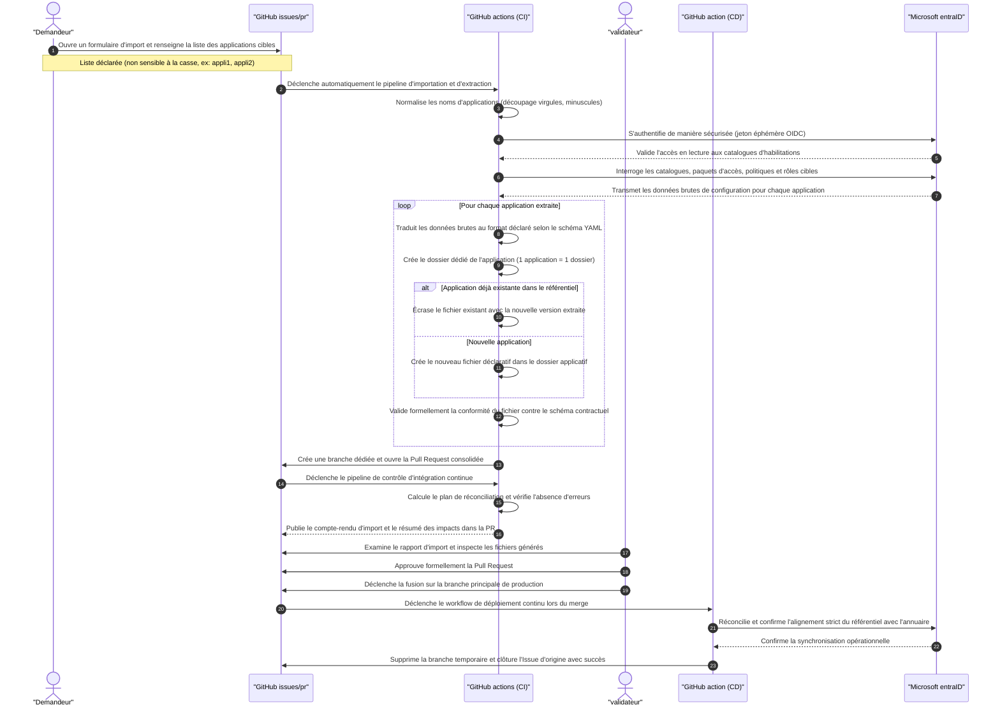

# Architecture Technique & Modèle de Dépôt Cible — GitOps Entitlement Management
## Industrialisation de l'Identity Governance Microsoft Entra ID
### Ardian — Architecture Cloud IAM & DevOps Platform

---

Ce document détaille l'architecture technique, la topologie complète du référentiel Git cible, les responsabilités de chaque composant, ainsi que le modèle de branching GitFlow et les règles de gouvernance associées.

---

## 1. 📐 Principes Fondateurs

* **Entra ID = Source Unique de Vérité (SSoT)** : Le référentiel GitHub contient les *intentions* fonctionnelles. L'annuaire Microsoft Entra ID contient la vérité opérationnelle absolue.
* **1 Application = 1 Catalogue = 1 Fichier YAML** : Isolation complète des droits par application dans `declarations/apps/<nom-app>.yaml`. Le rayon d'impact (*blast radius*) de chaque modification est unitaire.
* **Mode Consommateur Strict** : Le pipeline Terraform ne crée JAMAIS de groupe ou d'application Entra ID sous-jacente. Toutes les dépendances sont lues via des blocs `data`. Si un groupe manque dans Entra ID, le pipeline est interrompu immédiatement.
* **Authentification Zero-Secret (OIDC)** : Fédération d'identité Azure AD / GitHub Actions (*Workload Identity Federation*). Aucun mot de passe, clé ou secret statique longue durée n'est stocké dans GitHub.

---

## 2. 🗂️ Topologie & Structure Cible du Référentiel Git

Le référentiel est organisé comme une **usine GitOps modulaire et sécurisée**, séparant strictement les fichiers déclaratifs manipulés par les métiers des mécanismes d'automatisation, d'infrastructure et de gouvernance :

```text
ardian-entitlement-mgmt/
│
├── .github/                                  # ⚙️ MOTEUR D'AUTOMATISATION & GOUVERNANCE
│   ├── CODEOWNERS                            # Sécurité : Définition des approbateurs obligatoires par application
│   ├── ISSUE_TEMPLATE/
│   │   └── entitlement-management.yml        # 📦 L'Omni-Form : Formulaire unique (Création, Modif, Décommissionnement)
│   ├── scripts/                              # Scripts d'automatisation exécutés par la CI/CD
│   │   ├── parse-issue-body.py               # Extrait le YAML de l'Omni-Form et détermine l'action
│   │   ├── validate-schema.py                # Valide la syntaxe et la conformité au Schéma JSON v2
│   │   ├── discover-catalogs.py              # Smart Discovery : Interroge Graph API et génère imports.tf
│   │   ├── format-pr-comment.py              # Formate le tableau de bord d'impact clair dans la PR
│   │   └── reverse-engineer-entra.py         # Scanner d'export T0 : Aspire Entra ID vers du YAML v2
│   └── workflows/                            # Définition des pipelines GitHub Actions
│       ├── 01-issue-to-pr.yml                # Déclenchement automatique : Transforme l'Issue en branche & PR
│       ├── 02-download-yaml.yml              # Utilitaire : Télécharge le YAML actuel d'une app pour édition
│       ├── 03-ci-validate-and-plan.yml       # Pipeline CI : Validation, Smart Discovery, Plan & ChatOps (/replan)
│       ├── 04-cd-apply.yml                   # Pipeline CD : Déploiement OIDC dans Entra ID au merge sur main
│       ├── 05-reverse-engineering.yml        # T0 Admin : Synchronisation complète de l'existant Entra ID
│       └── 06-admin-bulk-ops.yml             # Admin : Workflow de modification transverse en masse
│
├── declarations/                             # 📄 RÉFÉRENTIEL MÉTIER DÉCLARATIF
│   ├── apps/                                 # 1 fichier = 1 catalogue applicatif
│   │   ├── _example.yaml                     # Fichier modèle ultra-documenté (ignoré par Terraform)
│   │   ├── catalogue-test-v1.yaml            # Déclaration du Catalogue Applicatif Test 1
│   │   ├── catalogue-test-v2.yaml            # Déclaration du Catalogue Applicatif Test 2
│   │   ├── salesforce-crm.yaml               # Exemple d'application d'entreprise réelle
│   │   └── sap-s4hana.yaml                   # Exemple d'application d'entreprise réelle
│   └── admin/                                # Espace d'administration transverse
│       └── bulk-change.yaml                  # Déclaration des modifications en masse ciblées
│
├── schemas/                                  # 🛡️ CONTRATS D'INTERFACE & VALIDATION
│   ├── app-declaration.schema.json           # JSON Schema Draft-07 (Contrat strict du format Ardian v2)
│   └── bulk-change.schema.json               # JSON Schema validant les opérations en masse
│
├── terraform/                                # 🏗️ MOTEUR D'INFRASTRUCTURE AS CODE (TERRAFORM)
│   ├── providers.tf                          # Provider AzureAD & configuration OIDC (Zero-Secret)
│   ├── backend.tf                            # State distant sécurisé sur Azure Blob Storage (avec verrou)
│   ├── variables.tf                          # Variables globales (tenant_id, declarations_path)
│   ├── locals.tf                             # Cœur data-driven : parsing dynamique et aplatissement des YAMLs
│   ├── data.tf                               # Contrôle SSoT : Recherche des Groupes et Enterprise Apps existants
│   ├── catalogs.tf                           # Gestion des catalogues Entitlement Management
│   ├── access_packages.tf                    # Création des paquets d'accès et attribution des rôles
│   ├── policies.tf                           # Politiques d'assignation, approbateurs et durées d'expiration
│   ├── resource_roles.tf                     # Liens Catalogue ➔ Ressources et Package ➔ Rôles
│   ├── imports.tf                            # Généré dynamiquement par Smart Discovery (ignoré par Git)
│   └── outputs.tf                            # Résumé des identifiants d'actifs déployés
│
├── scripts/                                  # 💻 OUTILLAGE POSTE ADMINISTRATEUR (LOCAL)
│   └── Invoke-BulkUpdate.ps1                 # Script PowerShell local avec simulation (Dry-Run) & auto-validation
│
├── docs/                                     # 📚 DOCUMENTATION D'ARCHITECTURE & RUN
│   ├── HLD_STRATEGIE_IMPLEMENTATION.md       # High-Level Design complet (Cadre de référence Ardian)
│   ├── SPECIFICATIONS_V2.md                  # Spécifications techniques détaillées du modèle cible V2
│   ├── SPECIFICATIONS_V1.md                  # Spécifications techniques initiales (Historique V1)
│   ├── ARCHITECTURE.md                       # Ce document (Architecture technique et structure du dépôt)
│   ├── OPERATIONAL_GUIDE.md                  # Guide pas-à-pas pour les IT Owners et Data Owners
│   └── PREREQUISITES.md                      # Pré-requis Azure, rôles Graph API et configuration OIDC
│
├── .gitignore                                # Fichiers exclus du versionnage (.terraform, tfstate, imports.tf)
└── README.md                                 # Hub d'accueil du projet et accès direct aux formulaires
```

---

### 2.1. Rôles des Blocs Fonctionnels

#### 1. Le Socle de Gouvernance & CI/CD (`.github/`)
* **L'Omni-Form (`entitlement-management.yml`)** : Interface utilisateur unique. L'IT Owner ne choisit plus entre 3 formulaires ; il glisse son fichier YAML et le pipeline déduit automatiquement s'il s'agit d'une création, d'une mise à jour ou d'un décommissionnement.
* **`CODEOWNERS`** : Verrou de sécurité garantissant qu'aucune modification ne peut être fusionnée sans l'approbation conjointe du propriétaire métier et de l'équipe Sécurité IAM.
* **Les Pipelines (`workflows/`)** :
  * `01-issue-to-pr` : Crée la branche éphémère et la Pull Request en moins de 5 secondes.
  * `03-ci-validate-and-plan` : Valide la syntaxe, inspecte Entra ID via OIDC, calcule le plan Terraform et publie le tableau de bord dans la PR. Il intègre le ChatOps (`/replan`) pour relancer la vérification dès qu'un groupe manquant a été créé dans Entra ID.
  * `04-cd-apply` : Déploie les configurations réelles dans Entra ID lors du merge sur `main` et détruit la branche temporaire.
  * `05-reverse-engineering` & `06-admin-bulk-ops` : Outillages administratifs réservés à l'équipe centrale IAM.

#### 2. Le Référentiel Métier Déclaratif (`declarations/`)
* C'est la **seule zone où les contributeurs interviennent**.
* Chaque fichier `declarations/apps/<nom-app>.yaml` représente **un catalogue applicatif complet** (description, Access Packages, rôles, approbateurs et environnement).
* Le fichier `_example.yaml` sert de modèle prêt à l'emploi. Le préfixe `_` informe Terraform et la Smart Discovery d'ignorer ce fichier.

#### 3. Le Moteur d'Infrastructure as Code (`terraform/`)
* Moteur aveugle et déterministe ne contenant **aucun nom d'application codé en dur**.
* `locals.tf` lit dynamiquement tous les fichiers YAML de `declarations/apps/`, les décode et alimente les modules de création (`catalogs.tf`, `access_packages.tf`, etc.).
* `data.tf` garantit le **mode consommateur strict** : il interroge Entra ID pour vérifier que les groupes de sécurité et applications existent réellement avant de planifier.
* `imports.tf` est volatile : généré à chaud par la Smart Discovery pendant la CI pour lier les catalogues existants, puis nettoyé.

#### 4. Les Contrats de Validation (`schemas/`)
* `app-declaration.schema.json` est le contrat d'interface JSON Schema Draft-07. Il bloque instantanément toute erreur de syntaxe, omission de champ obligatoire ou format d'email invalide avant même le démarrage de Terraform.

#### 5. L'Outillage Local Administrateur (`scripts/`)
* Contient le script PowerShell `Invoke-BulkUpdate.ps1` qui permet à un administrateur IAM d'effectuer des modifications transverses depuis son poste en mode sécurisé : **Simulation (Dry-Run)** ➔ **Rapport d'impact** ➔ **Validation formelle O/N** ➔ **Commit Git automatique**.

#### 6. Ce qui est Strictement Exclu de Git (`.gitignore`)
* Les états Terraform locaux (`*.tfstate`, `*.tfstate.backup`).
* Le dossier technique `.terraform/` et les providers binaires.
* Le fichier `terraform/imports.tf` (généré dynamiquement à chaque run de CI).

---

## 3. 🔄 Modèle de Branching GitFlow

Le cycle de vie du référentiel repose sur une branche principale protégée représentant l'état de production, alimentée par des branches de travail éphémères et isolées :

```mermaid
flowchart LR
    %% Définition des classes de style universelles
    classDef mainTrack fill:#0f172a,stroke:#3b82f6,stroke-width:2px,color:#ffffff;
    classDef userTrack fill:#064e3b,stroke:#10b981,stroke-width:2px,color:#ffffff;
    classDef adminTrack fill:#78350f,stroke:#f59e0b,stroke-width:2px,color:#ffffff;
    classDef resyncTrack fill:#4c1d95,stroke:#a855f7,stroke-width:2px,color:#ffffff;
    classDef gateNode fill:#7f1d1d,stroke:#ef4444,stroke-width:2px,color:#ffffff;
    classDef cleanNode fill:#1f2937,stroke:#6b7280,stroke-width:1px,color:#9ca3af,stroke-dasharray: 4 4;

    %% Couloir 1 : Production
    subgraph COULOIR_PROD["Branche Principale de Production (main)"]
        P1["Configuration Initiale"]
        P2["Fusion Demande Unitaire"]
        P3["Fusion Changement Masse"]
        P4["Alignement Initial T0"]
        P5["Déploiement Entra ID (Apply)"]
        P1 --> P2 --> P3 --> P4 --> P5
    end

    %% Couloir 2 : Branches éphémères utilisateurs
    subgraph COULOIR_USER["Branches Éphémères Unitaires (entitlement/*)"]
        U1["Formulaire Unique (Omni-Form)"]
        U2["Création Branche et Commit"]
        U3["Validation CI et Plan d'Impact"]
        U4{"Double Approbation (Métier et IAM)"}
        U1 --> U2 --> U3 --> U4
    end

    %% Couloir 3 : Branche administrative
    subgraph COULOIR_ADMIN["Branche Administrative (admin/bulk-*)"]
        A1["Déclaration Modification Masse"]
        A2{"Simulation et Confirmation"}
        A3["Application et Revue Consolidée"]
        A1 --> A2
        A2 -->|"Confirmé"| A3
        A2 -.->|"Annulé"| A_STOP["Interruption sans changement"]
    end

    %% Couloir 4 : Synchronisation T0
    subgraph COULOIR_RESYNC["Canal Rétro-Ingénierie (import/t0-resync)"]
        R1["Extraction Annuaire Réel"]
        R2{"Contrôle Qualité Nomenclature"}
        R3["Purge et Réécriture Complète"]
        R1 --> R2
        R2 -->|"Conforme"| R3
        R2 -.->|"Rejet"| R_REJET["Exclusion Applications Non Conformes"]
    end

    %% Liaisons inter-couloirs
    P1 -.->|"Déclenchement unitaire"| U1
    U4 == "Approbation conjointe accordée" ==> P2
    P2 -.->|"Suppression automatique"| SUPPR_U["Destruction branche éphémère"]

    P2 -.->|"Déclenchement admin"| A1
    A3 == "Validation globale IAM" ==> P3
    P3 -.->|"Suppression automatique"| SUPPR_A["Destruction branche éphémère"]

    P3 -.->|"Déclenchement manuel T0"| R1
    R3 == "Validation finale admin" ==> P4

    %% Application stricte des classes
    class P1,P2,P3,P4,P5 mainTrack;
    class U1,U2,U3 userTrack;
    class A1,A3 adminTrack;
    class R1,R3 resyncTrack;
    class U4,A2,R2 gateNode;
    class SUPPR_U,SUPPR_A,A_STOP,R_REJET cleanNode;
```



---

## 4. 🛡️ Règles de Gouvernance et de Protection des Branches

Pour garantir l'intégrité de la branche de référence (`main`), les règles de protection suivantes sont appliquées de manière infranchissable :

| Composant | Règle / Caractéristique | Justification & Sécurité |
|:---|:---|:---|
| **Branche `main`** | • **Branch Protection activée**<br>• Push direct formellement interdit à tous (y compris administrateurs)<br>• Fusion autorisée uniquement via Pull Request signée | Garantit qu'aucun changement ne contourne la validation CI ni la double approbation humaine. |
| **Branches de travail** | • Nomenclature : `entitlement/{operation}-{app}-{timestamp}`<br>• Création automatique par le bot de CI<br>• Suppression automatique après fusion | Évite les conflits de nommage et garantit un environnement éphémère et propre pour chaque opération. |
| **Statuts CI pré-requis** | • Validation syntaxique & schéma JSON valide<br>• Succès du `terraform plan`<br>• Détection de 0 asset bloquant non résolu | Empêche tout merge si une ressource Entra ID déclarée est absente de l'annuaire. |
| **Stratégie de Fusion** | **Squash and Merge** | Maintient un historique linéaire, clair et facilement auditable sur `main` (1 commit = 1 déploiement applicatif traçable). |

---

## 5. 🚀 Description des Pipelines CI/CD

1. **Utilisateur / Métier** : Dépose son fichier déclaratif via le formulaire unique (Omni-Form).
2. **Workflow `01-issue-to-pr.yml`** : Parse l'Issue via `parse-issue-body.py`, détermine l'opération (Création, Modification ou Décommissionnement via `action: delete_application`), crée la branche éphémère et ouvre automatiquement la Pull Request.
3. **Workflow `03-ci-validate-and-plan.yml`** : Valide la conformité du fichier avec le schéma JSON v2, lance la Smart Discovery pour détecter les catalogues et ressources existants, puis exécute `terraform plan` via OIDC pour valider les dépendances SSoT dans Entra ID. Restitue le plan dans un commentaire formaté. En cas de ressources manquantes, bloque la PR et permet la relance par ChatOps (`/replan`).
4. **Sas d'Approbation** : Le Data Owner métier et le responsable IAM / Sécurité Cloud examinent le plan d'impact et approuvent formellement la PR.
5. **Workflow `04-cd-apply.yml`** : Au merge sur `main`, exécute `terraform apply -auto-approve` pour déployer dans Entra ID, met à jour les formulaires de sélection et supprime la branche de travail.

---

## 6. 🔄 Diagramme de Séquence : Import depuis Entra ID (Reverse Engineering)

Ce scénario permet d'exporter la configuration réelle des habilitations existantes dans **Microsoft Entra ID** vers le référentiel GitHub sous forme de fichiers déclaratifs YAML conformes au schéma de la plateforme.

### 6.1. Fonctionnement & Règles de Gestion
* **Formulaire d'Issue Dédié** : Le demandeur ouvre une Issue spécifique dans laquelle il renseigne, dans un champ dédié, la liste des applications cibles séparées par des virgules (ex: `appli1, appli2, Appli3...`).
* **Insensibilité à la Casse** : Les noms saisis sont normalisés et recherchés dans Entra ID indépendamment des majuscules ou minuscules.
* **Topologie Déclarative Cible** : Chaque application importée est structurée selon la convention **1 application = 1 dossier contenant 1 fichier YAML** (ex: `declarations/apps/<nom-application>/<nom-application>.yaml`).
* **Règle d'Écrasement (*Overwrite*)** : Si une application importée est déjà présente dans le référentiel Git, ses fichiers existants sont automatiquement remplacés et écrasés par l'état extrait de Microsoft Entra ID.
* **Validation & Déploiement** : Une Pull Request est créée automatiquement avec un rapport d'import, soumise à la vérification d'un validateur habilité, puis réconciliée en continu lors du merge.

### 6.2. Diagramme de Séquence Détaillé (Mermaid.js)



