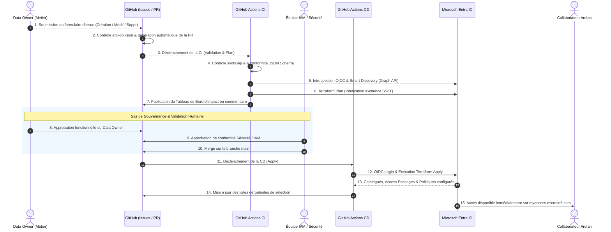
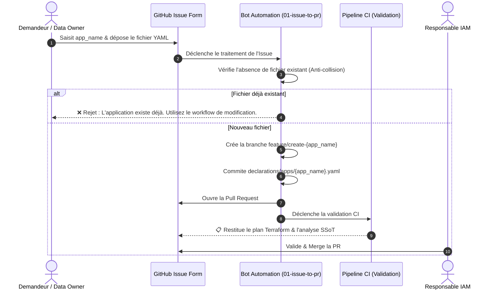
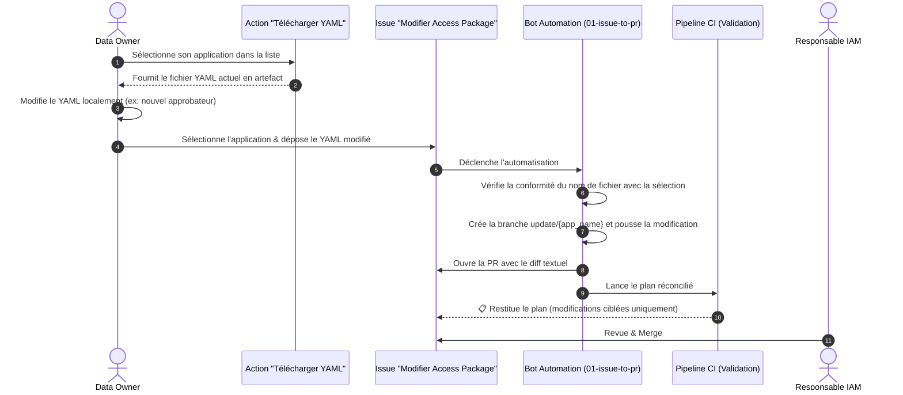
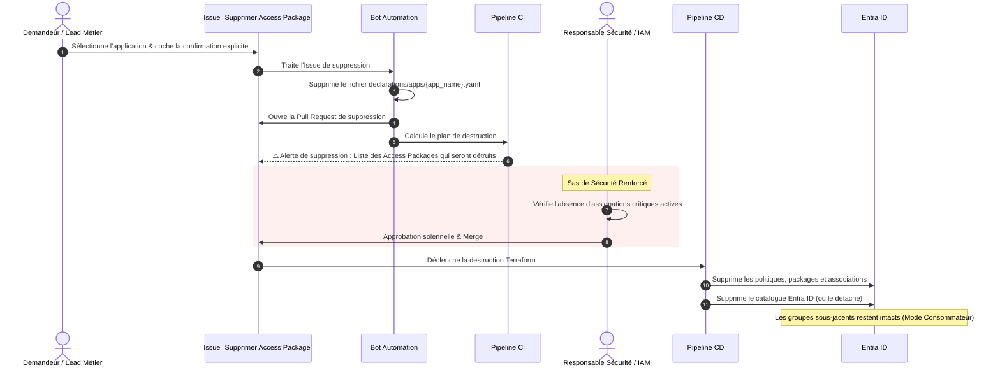

# Document de Stratégie d'Implémentation (Design Doc)
## Modèle Opérationnel "Run" — Entitlement Management Entra ID sous GitOps
### Ardian — Architecture Cloud IAM & Sécurité des Accès

---

| Métadonnée | Valeur |
|:---|:---|
| **Client** | Ardian |
| **Projet** | Industrialisation & Automatisation de l'Identity Governance (Entra ID) |
| **Document** | Document de Stratégie d'Implémentation (Design Doc — Modèle de Run) |
| **Rôle / Auteur** | Architecte Cloud IAM & Gouvernance |
| **Destinataires** | Architecture Review Board, Équipe IAM, Responsables Sécurité Cloud |
| **Statut** | **Pour Arbitrage et Validation** |
| **Version** | 2.0 (Post-Lab & Validation Industrielle) |

---

## Synthèse Exécutive

Dans le cadre de la modernisation de sa gouvernance des accès et de la conformité aux exigences réglementaires strictes (séparation des tâches, moindre privilège, auditabilité ISO 27001 / SOX), **Ardian** fait évoluer l'administration de ses habilitations Microsoft Entra ID d'un mode manuel vers un modèle **GitOps Déclaratif & Zero-Trust**.

Ce document formalise les **principes d'ingénierie**, les **arbitrages d'architecture soumis à validation**, l'**architecture fonctionnelle globale** et les **trois scénarios opérationnels du Run** (Création, Modification, Décommissionnement). Il est conçu pour offrir aux décideurs et équipes techniques la visibilité nécessaire pour valider la mise en production du modèle.

---

## 1. Principes d'Architecture (À Valider par Ardian)

Les choix d'architecture reposent sur une volonté de rigueur, de simplicité pour les équipes métiers (*Data Owners*) et d'intégrité absolue de l'annuaire Entra ID.

```
┌─────────────────────────────────────────────────────────────────────────────────┐
│                           SOCLE D'INGÉNIERIE GITOPS                             │
├───────────────────────┬─────────────────────────┬───────────────────────────────┤
│  1 App = 1 Fichier    │  Mode Consommateur      │  Entra ID = SSoT Absolue      │
│  Isolation stricte    │  Aucune création cible  │  Smart Discovery & Idempotence│
├───────────────────────┼─────────────────────────┼───────────────────────────────┤
│  Zero-Secret OIDC     │  Anti-Collision         │  Validation Humaine Éclairée  │
│  Fédération Azure-GH  │  Impossibilité d'écraser│  Plan enrichi & SoD Métier    │
└───────────────────────┴─────────────────────────┴───────────────────────────────┘
```

### 1.1. Granularité Déclarative : 1 Fichier YAML = 1 Application (Catalogue)
* **Choix d'ingénierie** : Chaque application d'entreprise possède son unique fichier déclaratif dans `declarations/apps/<app_name>.yaml`. Ce fichier modélise l'ensemble de son catalogue, ses Access Packages, ses ressources rattachées et ses règles d'assignation.
* **Bénéfice Ardian** :
  * **Isolation totale des risques** : une modification sur le catalogue CRM ne peut en aucun cas impacter les catalogues ERP ou Core Banking.
  * **Blast radius unitaire** : les revues de code, la traçabilité Git et les pipelines ciblent précisément le composant modifié.

### 1.2. Mécanisme Anti-Collision & Verrouillage à la Création
* **Choix d'ingénierie** : Il est techniquement impossible de créer un nouveau fichier YAML pour une application déjà enregistrée dans le référentiel.
* **Fonctionnement** :
  * Si un utilisateur soumet une demande de création pour une application dont le fichier `declarations/apps/<nom>.yaml` existe déjà, le workflow d'ingestion rejette la demande à la source.
  * Un message explicite oriente le demandeur vers le **workflow de modification**. Ce verrou prévient tout écrasement d'historique ou dérive de configuration involontaire.

### 1.3. Principe du Consommateur Strict (*Consumer-Only Model*)
* **Choix d'ingénierie** : L'usine Terraform est un **consommateur pur** d'actifs préexistants. Elle **ne crée jamais** les ressources cibles (Groupes de sécurité, Enterprise Applications, App Registrations, Sites SharePoint, App Roles).
* **Raison d'être** : La création d'un groupe ou d'un rôle applicatif relève de processus d'ingénierie système ou DevSecOps distincts. Mélanger création d'infrastructure sous-jacente et gouvernance des accès violerait le principe de séparation des responsabilités.

> [!IMPORTANT]
> ### 📌 Proposition à valider avec Ardian (Décision 1) : Workflow de création des App Roles & Groupes
> Lorsqu'un métier a besoin d'un nouveau groupe ou d'un nouvel *App Role* non existant dans Entra ID :
> * **Option A (Recommandée - Standard)** : Établir un sas préalable via le système de ticketing d'Ardian (ServiceNow / Jira). L'équipe Identity/Packaging livre le groupe ou rôle dans Entra ID ; le Data Owner soumet ensuite son YAML Entitlement Management.
> * **Option B (Intégration amont)** : Créer un workflow GitHub Actions séparé permettant aux équipes habilitées de déclarer et provisionner les groupes standards avant d'ouvrir les catalogues.

### 1.4. Entra ID = Source Unique de Vérité (SSoT) & Smart Discovery
* **Choix d'ingénierie** : Git n'exprime que l'**intention** ; l'état réel dans le tenant Entra ID constitue la **vérité opérationnelle absolue**.
* **Smart Discovery & Auto-Import** :
  * Avant chaque calcul de plan Terraform, un script d'introspection interroge l'API Microsoft Graph (`/identityGovernance/entitlementManagement/catalogs`).
  * Il détecte les catalogues et ressources déjà présents dans Entra ID (y compris les ressources pré-associées).
  * Il génère dynamiquement des blocs `import {}` (Terraform 1.5+).
  * **Résultat** : Zéro destruction intempestive (`0 to destroy`), élimination des erreurs HTTP 409 (*Conflict*), et réconciliation sans douleur entre les actifs déjà existants et le code.

> [!IMPORTANT]
> ### 📌 Proposition à valider avec Ardian (Décision 2) : Amorçage à $T_0$ par Reverse-Engineering
> Pour embarquer le parc applicatif existant sans saisie manuelle fastidieuse :
> * **Proposition** : Exécuter un **scanner d'export à $T_0$** (script PowerShell / Python Graph API) qui inspecte tous les catalogues Entra ID existants et produit automatiquement les fichiers YAML initiaux conformes au schéma Ardian v2.
> * **Bénéfice** : Adhésion immédiate au référentiel GitOps, absence de rupture de service et bascule immédiate en mode managé.

### 1.5. Authentification Zero-Trust OIDC (Secret-less)
* **Choix d'ingénierie** : **Zero secret statique** stocké dans GitHub (aucun mot de passe de compte de service, aucun secret d'application d'une durée d'un an).
* **Mécanisme** : Fédération d'identité Azure AD / GitHub Actions (*Workload Identity Federation / OIDC*).
* **Bénéfice** :
  * Les jetons d'accès émis sont éphémères (durée de vie < 1h), signés cryptographiquement et limités strictement à l'environnement d'exécution du repository Ardian.
  * Conformité directe aux exigences ANSSI et CIS Benchmarks.

### 1.6. Gouvernance, Sécurité & Étapes de Validation Humaine

La sécurité du modèle repose sur une séparation stricte des rôles et des barrières de contrôle non contournables.

| Question Fondamentale | Réponse & Décision d'Architecture Proposée |
|:---|:---|
| **À quelle étape la validation humaine intervient-elle ?** | **Au niveau de la Pull Request**. Aucune modification ne peut atteindre la branche `main` ni s'appliquer sur Entra ID sans approbation humaine formelle. |
| **Qui valide ? (Séparation des Tâches)** | **Double Approbation obligatoire** via le mécanisme `CODEOWNERS` :<br>1. **Data Owner** : valide l'expression du besoin métier et l'éligibilité des demandeurs.<br>2. **Équipe IAM / Sécurité Cloud** : valide l'absence de droits excessifs et la conformité aux standards Ardian (durées, réviseurs). |
| **Quelles informations sont restituées aux validateurs ?** | La CI publie automatiquement sur la PR un **tableau de bord d'impact lisible** (voir ci-dessous). |

#### Le Tableau de Bord d'Impact PR (Restitution aux Réviseurs)
Avant d'approuver, les validateurs disposent d'une vue synthétique claire :
* 🆕 **Assets qui seront créés** si le merge est confirmé : Catalogues, Access Packages, Politiques d'assignation, liens ressources.
* 🚫 **Assets bloquants à créer avant de lancer le merge** : Groupes ou App Roles introuvables dans Entra ID (évite les échecs tardifs).
* 🗑️ **Assets qui seront décommissionnés** : Alertes en cas de suppression d'Access Packages.
* 👥 **Gouvernance des accès** : Liste nominative des approbateurs (`authorization_owners`) et mode d'octroi (*Owner Only* vs *Self-Service*).

---

## 2. Architecture Fonctionnelle & Cycle de Vie GitOps

Le cycle de vie complet relie l'expression du besoin par le métier à la mise à disposition effective des accès dans le portail **Microsoft MyAccess** d'Ardian.



---

## 3. Scénarios d'Opération (Le Run)

### 3.1. Scénario A : Création d'une Nouvelle Application / Nouveaux Access Packages

#### Description High-Level
Le Data Owner ou l'équipe projet souhaite intégrer une nouvelle application dans le portail d'accès. Il accède au formulaire GitHub Issue **"🆕 Créer un Access Package"**, renseigne les métadonnées et glisse-dépose son fichier YAML préalablement rédigé.

#### Schéma de Séquence — Scénario A


#### Mini-Tuto : Structure du Fichier YAML (Format Ardian v2)
Voici le canevas type qu'un Data Owner doit renseigner pour déclarer son application :

```yaml
# ==============================================================================
# 1. IDENTIFICATION DU CATALOGUE (1 fichier = 1 catalogue)
# ==============================================================================
app_name: "salesforce-crm"               # Identifiant kebab-case (doit être identique au nom du fichier)
app_description: "Gestion des accès et rôles à la plateforme Salesforce CRM Ardian"

# ==============================================================================
# 2. LISTE DES ACCESS PACKAGES
# ==============================================================================
access_packages:

  # ----------------------------------------------------------------------------
  # Access Package 1 : Accès Standard (Lecture Seule)
  # Nom généré : "Salesforce Standard Read Only - Prod"
  # ----------------------------------------------------------------------------
  - context_subapp: "Salesforce Standard"  # Contexte ou sous-domaine fonctionnel
    privilege_level: "Read Only"          # Niveau de privilège (ex: Read Only, User, Admin)
    env: "Prod"                           # Environnement (Dev, UAT, Prod)
    description: "Accès en consultation aux comptes et opportunités commerciales"
    
    # Approbateurs de la demande (Data Owners habilités à valider)
    authorization_owners:
      - "sophie.martin@ardian.com"
      - "pierre.dupont@ardian.com"
      
    # owner_only:
    #   false = Disponible en self-service pour les utilisateurs dans MyAccess
    #   true  = Assignable uniquement par l'administrateur / Data Owner
    owner_only: false

    # Ressources affectées par ce package
    resources:
      # Option 1 : Groupe Entra ID (le groupe doit pré-exister dans Entra ID)
      - resource_type: "EntraID Group"
        group_name: "GRP-APP-Salesforce-ReadOnly"

  # ----------------------------------------------------------------------------
  # Access Package 2 : Accès Privilégié (Rôle Applicatif)
  # Nom généré : "Salesforce Admin - Prod"
  # ----------------------------------------------------------------------------
  - context_subapp: "Salesforce"
    privilege_level: "Admin"
    env: "Prod"
    description: "Droits d'administration applicative Salesforce"
    authorization_owners:
      - "lead-iam@ardian.com"
    owner_only: true                      # Accès sensible : attribution directe par admin

    resources:
      # Option 2 : Rôle applicatif (l'Enterprise App et le rôle doivent pré-exister)
      - resource_type: "Application Role"
        enterprise_app: "Salesforce Corporate"
        app_role: "SystemAdministrator"
```

> [!WARNING]
> ### 🛡️ Gestion des Erreurs — Scénario A
> * **Erreur de syntaxe YAML ou non-conformité JSON Schema** :
>   * *Conséquence* : Le job CI `validate-schema` échoue immédiatement avec le numéro de ligne précis et la règle violée (ex: adresse email invalide, champ manquant).
>   * *Impact tenant* : **Strictement aucun**. Aucune commande Terraform n'est exécutée.
> * **Ressource déclarée introuvable dans Entra ID** :
>   * *Conséquence* : La CI identifie la ressource manquante et marque le statut en `🚫 Asset bloquant`. Le plan Terraform refuse d'avancer.
>   * *Action requise* : Le demandeur doit solliciter la création du groupe/rôle auprès de l'équipe IAM avant de redéclencher la PR.

---

### 3.2. Scénario B : Modification d'une Application Existante

#### Description High-Level
Pour faire évoluer une application (ajout d'un environnement, ajustement d'approbateurs, nouveau profil d'accès), le Data Owner :
1. Sélectionne l'application via le menu déroulant dynamique du formulaire **"✏️ Modifier un Access Package"**.
2. Télécharge le fichier YAML actuel généré en un clic par l'Action dédiée.
3. Modifie le fichier sur son poste et le re-soumet dans le formulaire.

#### Schéma de Séquence — Scénario B


> [!WARNING]
> ### 🛡️ Gestion des Erreurs — Scénario B
> * **Conflits d'édition concurrente** : Si deux administrateurs modifient la même application en parallèle, le mécanisme de Pull Request Git détecte automatiquement le conflit (`Merge Conflict`). Le deuxième demandeur est invité à synchroniser sa version.
> * **Modification non autorisée (Privilege Escalation)** : Les fichiers déclaratifs sont sous le contrôle de la politique `CODEOWNERS`. Un Data Owner ne peut pas modifier un fichier YAML appartenant à un autre département sans l'accord des approbateurs désignés.

---

### 3.3. Scénario C : Décommissionnement / Suppression d'un Catalogue ou d'un Access Package

#### Description High-Level
Le retrait d'un accès ou le décommissionnement complet d'une application obéit à une procédure sécurisée pour éviter toute rupture de service inattendue pour les utilisateurs finaux.
* Pour retirer **un Access Package spécifique** : le Data Owner supprime le bloc correspondant dans le fichier YAML via le Scénario B.
* Pour supprimer **l'intégralité d'un Catalogue** : le demandeur utilise le formulaire **"🗑️ Supprimer un Access Package"** et confirme son intention.

#### Schéma de Séquence — Scénario C


> [!CAUTION]
> ### 🛡️ Gestion des Erreurs et Garde-Fous — Scénario C
> * **Préservation des ressources sous-jacentes** : Grâce au **Mode Consommateur Strict**, la destruction d'un catalogue ou d'un package dans Entitlement Management **ne supprime jamais les groupes Entra ID ni les applications cibles**. Seuls les liens d'attribution d'accès sont révoqués.
> * **Garde-fou sur les utilisateurs actifs** : Avant de valider la suppression d'un Access Package en production, l'équipe IAM contrôle dans le portail Entra ID qu'aucune assignation active critique n'est en cours. Une bonne pratique consiste à passer le package en `owner_only: true` ou masqué pendant 14 jours avant purge définitive.

---

## 4. Matrice des Décisions Soumises à l'Arbitrage d'Ardian

Pour engager la mise en production du modèle cible, les arbitrages suivants doivent être validés par les parties prenantes :

| Réf | Thématique | Choix Recommandé | Parties Prenantes | Statut |
|:---|:---|:---|:---|:---:|
| **DEC-01** | **Règle 1 YAML = 1 Application** | Adoption du principe d'isolation stricte par fichier. | Architecture & Équipe IAM | 🟡 À valider |
| **DEC-02** | **Création des actifs cibles** | Validation de l'Option A (Sas préalable ServiceNow/Jira pour les groupes et App Roles). | Support IAM & DevSecOps | 🟡 À valider |
| **DEC-03** | **Amorçage à $T_0$ (Reverse-Eng)** | Autorisation de lancer le scanner d'export Graph API pour amorcer le dépôt Git sans ressaisie. | Responsable Plateforme Cloud | 🟡 À valider |
| **DEC-04** | **Gouvernance PR & Signatures** | Validation de la double revue obligatoire (Data Owner métier + Lead Sécurité IAM). | Responsable SSI / CISO | 🟡 À valider |

---

> [!TIP]
> **Prochaine étape** : Dès validation de ces 4 arbitrages par l'Architecture Review Board d'Ardian, le script d'export $T_0$ sera déployé pour initialiser les catalogues actuels, ouvrant la phase de pilote opérationnel.
