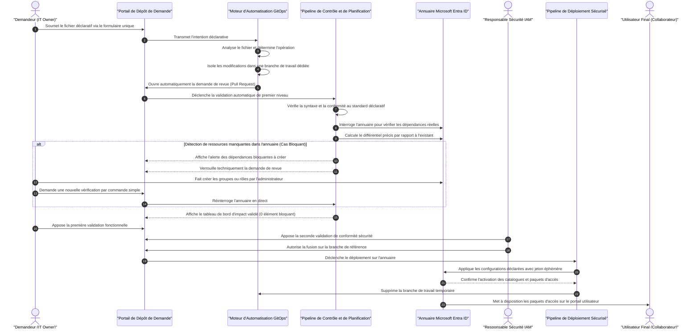
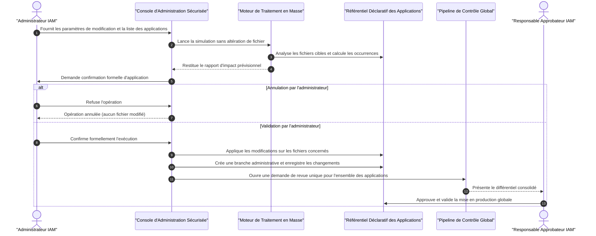
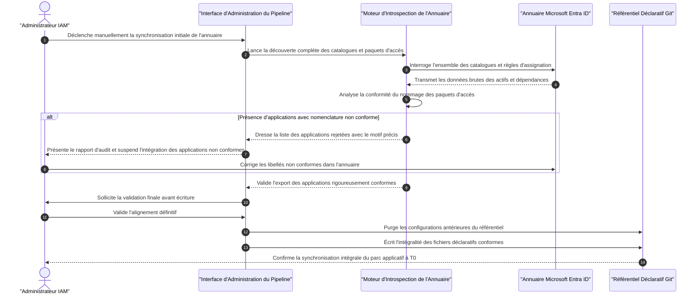
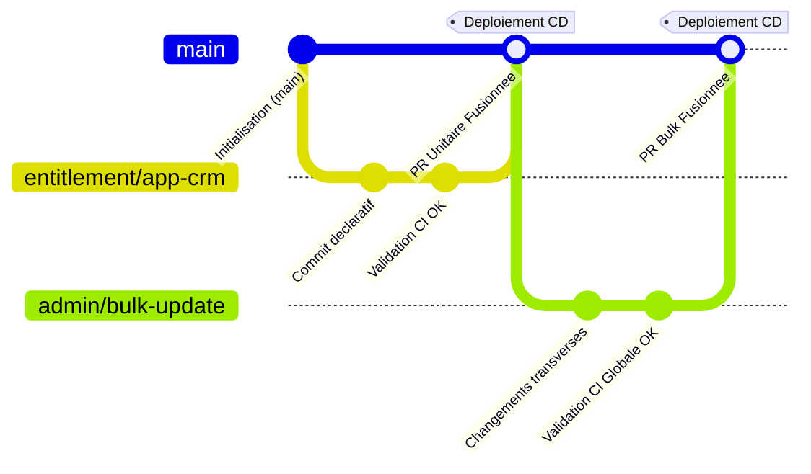

# Document de Stratégie d'Implémentation GitOps (High-Level Design — HLD)
## Automatisation & Gouvernance de l'Entitlement Management Microsoft Entra ID
### Ardian — Architecture Cloud IAM & Sécurité des Accès

---

| Métadonnée | Valeur |
|:---|:---|
| **Client** | Ardian |
| **Projet** | Industrialisation & Automatisation de l'Identity Governance (Entra ID) |
| **Document** | High-Level Design (HLD) — Stratégie d'Implémentation du Modèle de "Run" |
| **Rôle / Auteur** | Architecte Cloud IAM & DevOps Platform |
| **Destinataires** | Architecture Review Board, Équipe IAM, Responsables Sécurité Cloud & Audit |
| **Statut** | **Pour Arbitrage et Validation Formelle** |
| **Version** | 2.0 (Intégration du Modèle Omni-Form, Bulk Operations & 3 Niveaux de Contrôle) |

---

## 1. Synthèse Exécutive

Ardian modernise la gouvernance de ses accès en faisant évoluer l'administration de Microsoft Entra ID Identity Governance d'un modèle manuel vers une approche **GitOps Déclarative et Zero-Trust**. Ce projet répond aux exigences réglementaires et de sécurité les plus strictes (ISO 27001, SOX, séparation des tâches), en garantissant que chaque création, modification ou décommissionnement de droits applicatifs soit entièrement tracé, audité et validé formellement avant tout déploiement.

L'architecture proposée positionne **Microsoft Entra ID comme la Source Unique de Vérité (SSoT)** absolue du système d'information, tandis que le référentiel Git héberge l'expression des intentions fonctionnelles sous forme de spécifications YAML simplifiées. Grâce à une chaîne d'automatisation sécurisée par fédération d'identité sans secret statique (OIDC), le modèle réconcilie l'autonomie des propriétaires d'applications métiers (*IT Owners / Data Owners*) avec le contrôle rigoureux et centralisé de l'équipe Sécurité IAM.

---

## 2. Principes d'Architecture

Les choix d'ingénierie présentés ci-dessous constituent le socle technique et opérationnel soumis à la validation d'Ardian :

| Choix d'Architecture | Justification et Bénéfices pour Ardian |
|:---|:---|
| **1 Fichier YAML = 1 Application = 1 Branche** | **Isolation stricte des risques et du périmètre de changement (*Blast Radius*)**.<br>Une modification apportée aux accès d'une application (ex: CRM) est encapsulée dans sa propre branche et son propre fichier, rendant techniquement impossible tout effet de bord sur les autres catalogues de l'entreprise (ex: ERP). La revue de code est unitaire, lisible et parfaitement auditable. |
| **Modèle de Consommateur Strict** | **Respect fondamental de la séparation des responsabilités système**.<br>Le pipeline GitOps est un consommateur pur : il ne provisionne jamais les ressources cibles sous-jacentes (Groupes de sécurité, Enterprise Applications, Rôles applicatifs, Sites SharePoint). Ces objets relèvent d'autres processus d'infrastructure ou de packaging. Si une ressource déclarée n'existe pas dans Entra ID, le déploiement est interrompu. |
| **Entra ID comme Single Source of Truth (SSoT)** | **Alignement permanent avec la réalité opérationnelle de l'annuaire d'entreprise**.<br>Le référentiel Git n'exprime que l'intention ; l'état réel dans le tenant Entra ID fait foi. Ce principe est garanti par deux mécanismes clés :<br>1. **Le sas d'alignement préalable (*Smart Discovery*)** qui inspecte le tenant avant chaque planification pour détecter l'existant, générer les adoptions dynamiques et éliminer les conflits HTTP 409.<br>2. **Le scénario exceptionnel de Rétro-Ingénierie (*Reverse Engineering*)** permettant d'aspirer l'existant Entra ID pour réinitialiser le référentiel Git à $T_0$. |
| **Fédération d'Identité OIDC (Zero-Secret)** | **Sécurité maximale du pipeline CI/CD sans stockage d'identifiants sensibles**.<br>Aucun secret client, mot de passe de compte de service ou certificat statique n'est stocké dans GitHub. L'authentification repose sur des jetons cryptographiques éphémères émis par GitHub et validés par Entra ID (*Workload Identity Federation*), répondant aux standards ANSSI et CIS Benchmarks. |
| **Modifications en Masse Réservées aux Administrateurs** | **Protection contre les dérives massives tout en offrant la vélocité nécessaire au Run**.<br>Les utilisateurs métiers sont cantonnés à des modifications unitaires encadrées. Seuls les administrateurs IAM habilités peuvent initier des changements transverses (ex: mise à jour d'un approbateur commun), sous réserve d'une phase obligatoire de simulation préalable et d'une validation explicite d'impact. |

---

### 2.1. Gouvernance, Sécurité et Étapes de Validation

Pour concilier automatisation et contrôle des risques, le modèle repose sur une gouvernance d'approbation à **trois niveaux stricts** :

```
┌─────────────────────────────────┐
│          VALIDATION 1           │  Automatique (Pipeline CI)
│  Syntaxe & Conformité Schéma v2 │  Bloquant technique immédiat
└────────────────┬────────────────┘
                 │
                 ▼
┌─────────────────────────────────┐
│          VALIDATION 2           │  IT Owner (Demandeur Métier)
│   Détection Dépendances SSoT    │  Vérification de l'existence des actifs cibles
│ (Groupes, App Roles, SP Sites)  │  Bloquant strict si ressource manquante
└────────────────┬────────────────┘
                 │
                 ▼
┌─────────────────────────────────┐
│          VALIDATION 3           │  IT Owner + Responsable Sécurité IAM
│     Double Approbation Merge    │  Double validation formelle (SoD) avant exécution
└─────────────────────────────────┘
```

| Question Fondamentale | Réponse et Proposition d'Architecture |
|:---|:---|
| **À quelles étapes la validation humaine intervient-elle ?** | La validation humaine intervient à **deux moments distincts et obligatoires** au niveau de la Pull Request :<br>1. **À la Validation 2 (Revue d'impact SSoT)** : L'IT Owner examine le plan d'exécution calculé par rapport à l'annuaire réel.<br>2. **À la Validation 3 (Autorisation de mise en production)** : Sas formel où le merge et le déploiement sur Entra ID sont bloqués tant que les approbations requises ne sont pas apposées. |
| **Qui valide ? (Rôles & Ségrégation des Tâches)** | **Une double signature obligatoire (*Segregation of Duties - SoD*)** :<br>• **L'IT Owner / Data Owner** : Valide l'adéquation fonctionnelle du besoin, les profils d'accès demandés et l'éligibilité des approbateurs.<br>• **L'équipe Sécurité IAM** : Valide la conformité aux politiques de sécurité d'Ardian, le respect du moindre privilège, les durées de rétention des accès et l'absence de droits excessifs. |
| **Quelles informations sont restituées aux validateurs à chaque étape ?** | Le pipeline publie automatiquement un **Tableau de Bord d'Impact Clair et Structuré** directement dans la Pull Request :<br>• **En Validation 1 & 2** : Synthèse des modifications prévues, détails des approbateurs et politiques d'expiration, et surtout la section d'alerte rouge **`🚫 Assets bloquants à créer avant de lancer le merge`** listant précisément les groupes ou rôles absents d'Entra ID.<br>• **En Validation 3** : Confirmation du statut vert (0 ressource bloquante) et récapitulatif définitif des ajouts, modifications ou révocations avant accord de déploiement. |

---

## 3. Architecture Fonctionnelle et Cycle de Vie GitOps

Le diagramme ci-dessous illustre le flux opérationnel standard de bout en bout, depuis la formalisation du besoin par le demandeur jusqu'à la disponibilité effective des habilitations dans le portail utilisateur :



---

## 4. Scénarios d'Opération (Le Run)

### A. Le Workflow Utilisateur (Création, Modification, Suppression)

#### 1. Le Concept de Formulaire Unique (*Omni-Form*)
Pour éliminer toute friction et éviter les erreurs d'aiguillage, les trois anciens formulaires séparés sont unifiés en **un seul point d'entrée didactique** :
* **Suppression de la saisie manuelle redondante** : L'utilisateur n'a plus à saisir manuellement le nom de son application. Le système extrait automatiquement l'identifiant technique à partir du contenu du fichier déposé.
* **Contenu du formulaire** :
  * Un guide visuel rappelant les conventions et pointant vers le modèle de référence.
  * Un champ unique de dépôt de fichier (glisser-déposer ou saisie directe).
  * Une explication claire de la détection automatique :
    * *Fichier d'une nouvelle application* ➔ Déclenchement automatique du flux de **Création**.
    * *Fichier d'une application existante* ➔ Déclenchement automatique du flux de **Mise à jour**.
    * *Fichier portant l'instruction de décommissionnement* ➔ Déclenchement du flux de **Suppression**.

#### 2. Gestion des Erreurs et Robustesse
* **Erreur de syntaxe ou structure invalide** : Rejet immédiat dès la phase de contrôle automatique. Aucun appel n'est émis vers Microsoft Entra ID.
* **Ressources cibles manquantes dans l'annuaire (Groupes, Rôles)** : Le système identifie précisément les éléments absents et marque la demande comme **bloquée**. Le bouton de fusion reste physiquement verrouillé. Dès que l'administrateur a créé la ressource dans Entra ID, le demandeur peut relancer la vérification **sans renvoyer son fichier**, par un simple commentaire de réévaluation sur la demande.
* **Modification non autorisée** : Le mécanisme de gouvernance par fichier empêche tout demandeur de modifier la configuration d'une application dont il n'est pas le propriétaire attitré.

#### 3. Cas Particulier du Décommissionnement (Suppression d'un Catalogue)
Pour garantir une suppression maîtrisée et sécurisée d'un catalogue applicatif :
* L'utilisateur dépose un fichier **volontairement épuré de tout rôle ou ressource**, comportant uniquement le nom de l'application et l'instruction explicite de décommissionnement :
  ```yaml
  app_name: "catalogue-test-v1"
  action: "delete_application"
  ```
* **Processus d'orchestration sécurisé** : Le moteur d'exécution procède selon un ordre strict :
  1. Il supprime et révoque d'abord l'ensemble des paquets d'accès (*Access Packages*) et leurs politiques associées.
  2. Il détache les ressources du catalogue.
  3. Il procède enfin à la suppression du catalogue lui-même.
* **Garde-fou Consommateur** : Les groupes de sécurité et les applications d'entreprise sous-jacents **ne sont jamais supprimés** dans Entra ID. Seules les règles d'attribution d'accès sont retirées.

---

### B. Le Workflow de Modification en Masse (Usage Administrateurs IAM)

#### 1. Justification et Périmètre Fonctionnel
Lors de changements transverses (ex: départ d'un responsable nécessitant la mise à jour de son email d'approbateur sur 20 catalogues applicatifs), le traitement fichier par fichier est fastidieux et générateur d'erreurs. Le mode de modification en masse permet d'appliquer un changement ciblé à l'ensemble des fichiers concernés en **une seule opération coordonnée**.

#### 2. Périmètre des Modifications Autorisées vs Interdites

| Catégorie | Éléments Autorisés en Masse | Éléments Strictement Interdits en Masse |
|:---|:---|:---|
| **Champs concernés** | • Remplacement d'une adresse email d'approbateur.<br>• Harmonisation d'un libellé d'environnement.<br>• Mise à jour d'un niveau de privilège unitaire. | • Restructuration complète de ressources d'un catalogue.<br>• Ajout d'associations complexes de groupes ou de rôles.<br>• Décommissionnement massif de catalogues. |
| **Raison d'ingénierie** | Modifications scalaires, atomiques et vérifiables par comparaison simple. | Risque de déstabilisation de la gouvernance globale. Les associations complexes doivent rester traitées de manière unitaire. |

#### 3. Structure du Fichier de Déclaration en Masse
L'administrateur décrit son intention dans un fichier dédié permettant de cibler les applications individuellement ou via une liste séparée par des virgules :

```yaml
# ==============================================================================
# DÉCLARATION DE MODIFICATION EN MASSE — USAGE ADMINISTRATEURS IAM
# ==============================================================================
bulk_change:
  description: "Remplacement du responsable d'approbation suite à un départ"
  
  # Applications concernées (séparées par une virgule, ou mot-clé "all") :
  target_apps: "catalogue-test-v1, catalogue-test-v2, salesforce-crm"
  
  # Propriété unitaire ciblée :
  target_field: "authorization_owners"
  
  # Règle de substitution :
  old_value: "ancien.responsable@ardian.com"
  new_value: "nouveau.responsable@ardian.com"
```

#### 4. Mécanisme de Contrôle Technique & Sas d'Auto-Validation
Pour garantir que seul un administrateur habilité puisse déclencher ce processus :
* **Verrouillage des droits d'exécution** : Le déclenchement est réservé exclusivement aux membres du groupe de sécurité central IAM via les contrôles d'accès basés sur les rôles (RBAC) de la plateforme.
* **Processus obligatoire en deux étapes (Dry-Run & Confirmation)** :
  1. **Phase de Simulation (Dry-Run)** : Le moteur analyse tous les fichiers déclaratifs, compte les occurrences trouvées, identifie les applications sans correspondance, et dresse un rapport de prévisualisation sans modifier aucun fichier.
  2. **Confirmation Explicite d'Impact** : Le moteur interroge formellement l'administrateur (*"Confirmez-vous la mise à jour de X fichiers pour Y occurrences ?"*). En l'absence d'accord explicite, l'opération s'interrompt immédiatement sans impact sur le disque.
  3. **Application & Revue Consolidée** : Après accord, les fichiers sont mis à jour et soumis dans **une unique demande de revue consolidée**, permettant à l'équipe IAM d'approuver l'ensemble des changements en un seul point de contrôle.

#### 5. Diagramme de Séquence — Scénario de Modification en Masse


---

### C. Gouvernance des Fichiers Déclaratifs via `CODEOWNERS`

La fonctionnalité `CODEOWNERS` permet d'attribuer formellement la responsabilité de chaque dossier ou fichier du référentiel à des équipes désignées. Lorsqu'une demande modifie un fichier protégé, la plateforme exige impérativement l'approbation du propriétaire avant toute mise en production.

Dans le cadre d'Ardian, deux options d'implémentation sont soumises à arbitrage :

> [!NOTE]
> ### 📌 Proposition à valider avec Ardian (Arbitrage 1) : Modèle de Responsabilité CODEOWNERS
>
> * **Option 1 : Gouvernance Déléguée (Co-Validation IT Owner + Équipe IAM)**
>   * *Fonctionnement* : Chaque fichier d'application a pour propriétaires obligatoires l'équipe métier référente ET l'équipe IAM.
>   * *Bénéfice* : Séparation absolue des pouvoirs. Un gestionnaire de l'application CRM ne peut en aucun cas approuver les modifications du catalogue ERP.
>   * *Contrainte* : Nécessite la gestion et le maintien de groupes d'utilisateurs distincts pour chaque domaine applicatif.
>
> * **Option 2 : Gouvernance Centralisée (Équipe IAM Exclusive)**
>   * *Fonctionnement* : L'équipe centrale IAM est déclarée propriétaire unique de l'ensemble des fichiers applicatifs.
>   * *Bénéfice* : Simplicité opérationnelle maximale pour le démarrage du Run, pas de dépendance envers la maturité technique des équipes métiers sur l'outil. L'équipe IAM agit comme guichet unique de validation technique et sécurité.
>   * *Recommandation de l'Architecte* : Démarrer en **Option 2** lors de la phase d'onboarding initial, puis activer l'**Option 1** application par application au fur et à mesure de la montée en maturité des IT Owners.

---

## 5. Rétro-Ingénierie (Récupération de l'Existant à $T_0$)

### 5.1. Contexte & Déclenchement Exceptionnel
La rétro-ingénierie est une opération administrative exceptionnelle, exécutée manuellement par l'équipe IAM. Elle a pour vocation d'aspirer la configuration réelle présente dans Microsoft Entra ID pour initialiser ou réaligner intégralement le référentiel déclaratif à $T_0$.

### 5.2. Règles d'Ingénierie & Principe de Synchronisation Totale (*Full Resync*)
* **Respect strict de la règle unitaire** : Le moteur génère un fichier par catalogue respectant rigoureusement le standard déclaratif Ardian.
* **Absence de demandes multiples** : Le processus ne génère pas de multiples demandes de revue dispersées ; il aligne directement l'ensemble des fichiers sur la branche de référence.
* **Principe de purge et de réinitialisation complète** : Pour prévenir tout risque d'incohérence si des fichiers préexistent dans le référentiel (ex: si Entra ID comporte les applications A, B et C alors que Git ne contient que l'application A ou des fichiers obsolètes), le workflow vide le répertoire applicatif (en conservant les modèles de référence) et réécrit l'intégralité du parc découvert.

### 5.3. Contrôle Bloquant de Conformité de Nomenclature (*Fail-Safe*)
* Pour être importé, chaque paquet d'accès au sein d'un catalogue doit respecter rigoureusement la convention de nommage Ardian : `[Sous-Domaine / Contexte] [Niveau de Privilège] - [Environnement]`.
* **Règle bloquante au niveau applicatif** : Si un seul paquet d'accès au sein d'un catalogue ne respecte pas cette nomenclature (ex: nommage hérité libre) :
  * **Le chargement de l'application entière échoue immédiatement**.
  * L'application est exclue de l'exportation vers le référentiel.
* **Rapport d'Audit Préalable** : Avant toute écriture définitive dans Git, le moteur génère un compte-rendu exhaustif listant :
  * Les applications conformes validées pour l'importation.
  * Les applications rejetées avec la mention précise du paquet d'accès non conforme.
  * L'administrateur doit corriger le libellé dans le portail Entra ID avant de relancer l'extraction.

### 5.4. Diagramme de Séquence — Scénario de Rétro-Ingénierie ($T_0$)


---

## 6. Stratégie de Gestion des Branches (GitFlow Cible)

### 6.1. Modèle de Branches GitFlow

Le modèle repose sur la combinaison d'une vue d'architecture fonctionnelle des couloirs de branches et de l'historique linéaire des commits :

```mermaid
flowchart LR
    %% Définition des classes de style universelles
    classDef mainTrack fill:#0f172a,stroke:#3b82f6,stroke-width:2px,color:#ffffff;
    classDef userTrack fill:#064e3b,stroke:#10b981,stroke-width:2px,color:#ffffff;
    classDef adminTrack fill:#78350f,stroke:#f59e0b,stroke-width:2px,color:#ffffff;
    classDef resyncTrack fill:#4c1d95,stroke:#a855f7,stroke-width:2px,color:#ffffff;
    classDef gateNode fill:#7f1d1d,stroke:#ef4444,stroke-width:2px,color:#ffffff;
    classDef cleanNode fill:#1f2937,stroke:#6b7280,stroke-width:1px,color:#9ca3af,stroke-dasharray: 4 4;

    %% Couloir 1 : Production
    subgraph COULOIR_PROD["Branche Principale de Production (main)"]
        P1["Configuration Initiale"]
        P2["Fusion Demande Unitaire"]
        P3["Fusion Changement Masse"]
        P4["Alignement Initial T0"]
        P5["Déploiement Entra ID (Apply)"]
        P1 --> P2 --> P3 --> P4 --> P5
    end

    %% Couloir 2 : Branches éphémères utilisateurs
    subgraph COULOIR_USER["Branches Éphémères Unitaires (entitlement/*)"]
        U1["Formulaire Unique (Omni-Form)"]
        U2["Création Branche et Commit"]
        U3["Validation CI et Plan d'Impact"]
        U4{"Double Approbation (Métier et IAM)"}
        U1 --> U2 --> U3 --> U4
    end

    %% Couloir 3 : Branche administrative
    subgraph COULOIR_ADMIN["Branche Administrative (admin/bulk-*)"]
        A1["Déclaration Modification Masse"]
        A2{"Simulation et Confirmation"}
        A3["Application et Revue Consolidée"]
        A1 --> A2
        A2 -->|"Confirmé"| A3
        A2 -.->|"Annulé"| A_STOP["Interruption sans changement"]
    end

    %% Couloir 4 : Synchronisation T0
    subgraph COULOIR_RESYNC["Canal Rétro-Ingénierie (import/t0-resync)"]
        R1["Extraction Annuaire Réel"]
        R2{"Contrôle Qualité Nomenclature"}
        R3["Purge et Réécriture Complète"]
        R1 --> R2
        R2 -->|"Conforme"| R3
        R2 -.->|"Rejet"| R_REJET["Exclusion Applications Non Conformes"]
    end

    %% Liaisons inter-couloirs
    P1 -.->|"Déclenchement unitaire"| U1
    U4 == "Approbation conjointe accordée" ==> P2
    P2 -.->|"Suppression automatique"| SUPPR_U["Destruction branche éphémère"]

    P2 -.->|"Déclenchement admin"| A1
    A3 == "Validation globale IAM" ==> P3
    P3 -.->|"Suppression automatique"| SUPPR_A["Destruction branche éphémère"]

    P3 -.->|"Déclenchement manuel T0"| R1
    R3 == "Validation finale admin" ==> P4

    %% Application stricte des classes
    class P1,P2,P3,P4,P5 mainTrack;
    class U1,U2,U3 userTrack;
    class A1,A3 adminTrack;
    class R1,R3 resyncTrack;
    class U4,A2,R2 gateNode;
    class SUPPR_U,SUPPR_A,A_STOP,R_REJET cleanNode;
```



#### Arbre des Commits (Format GitGraph Natif)



---

### 6.2. Règles de Gouvernance et de Protection des Branches

Pour garantir l'intégrité de la branche de référence (production), les règles de protection suivantes sont appliquées de manière infranchissable :

1. **Interdiction Formelle des Écritures Directes (*Direct Push Block*)** :
   * Aucun utilisateur, y compris les administrateurs globaux, ne peut pousser directement du code sur la branche principale. Toute modification transite obligatoirement par une demande de revue (*Pull Request*).
2. **Exigence de Contrôles Automatiques Valides (*Required Status Checks*)** :
   * Le passage au vert de la vérification de conformité syntaxique et du calcul de différentiel annuaire est un pré-requis absolu. La détection d'une ressource manquante bloque physiquement la fusion.
3. **Exigence de Double Revue Humaine Formelle (*Enforced Approvals*)** :
   * La fusion requiert obligatoirement deux approbations distinctes pour les demandes applicatives : celle de l'IT Owner désigné et celle d'un membre de l'équipe Sécurité IAM.
4. **Stratégie de Fusion Linéaire (*Squash and Merge*)** :
   * Les branches de travail éphémères sont compactées lors de la fusion afin de préserver un historique Git linéaire, clair et facilement auditable (1 déploiement = 1 commit horodaté et documenté).
5. **Suppression Automatique des Branches Éphémères (*Auto-Deletion*)** :
   * Dès la fusion validée, la branche de travail temporaire est automatiquement détruite pour éviter l'encombrement du référentiel.

---

## 7. Tableau de Synthèse des Décisions Soumises à Validation

| Référence | Objet de la Décision | Option Recommandée | Statut Soumis à Ardian |
|:---|:---|:---|:---:|
| **DEC-01** | **Modèle Déclaratif Unitaire** | Adoption stricte de la règle `1 Application = 1 Fichier = 1 Branche`. | 🟡 Pour Accord |
| **DEC-02** | **Formulaire Unique (Omni-Form)** | Remplacement des formulaires multiples par un point d'entrée unique didactique. | 🟡 Pour Accord |
| **DEC-03** | **Workflow de Validation à 3 Niveaux** | Validation CI ➔ Détection bloquante des ressources avec relance simplifiée ➔ Double approbation formelle. | 🟡 Pour Accord |
| **DEC-04** | **Gouvernance `CODEOWNERS`** | Démarrage en Option 2 (Gouvernance centralisée IAM) puis transition progressive vers l'Option 1 (Co-validation déléguée). | 🟡 Pour Arbitrage |
| **DEC-05** | **Modifications en Masse Sécurisées** | Déclenchement réservé aux administrateurs avec sas obligatoire de simulation (Dry-Run) et d'auto-validation. | 🟡 Pour Accord |
| **DEC-06** | **Rétro-Ingénierie ($T_0$) & Fail-Safe** | Processus exceptionnel d'aspiration avec rejet strict des applications non conformes à la nomenclature Ardian. | 🟡 Pour Accord |

---
*Ce document de design d'architecture constitue le cadre de référence pour engager les travaux d'implémentation opérationnelle de la plateforme d'Entitlement Management.*
