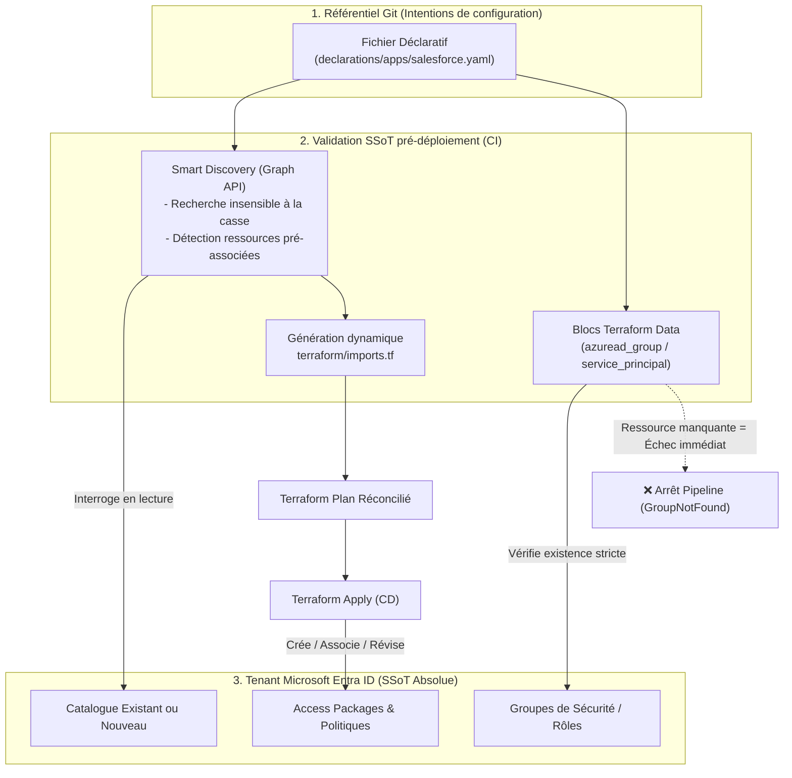
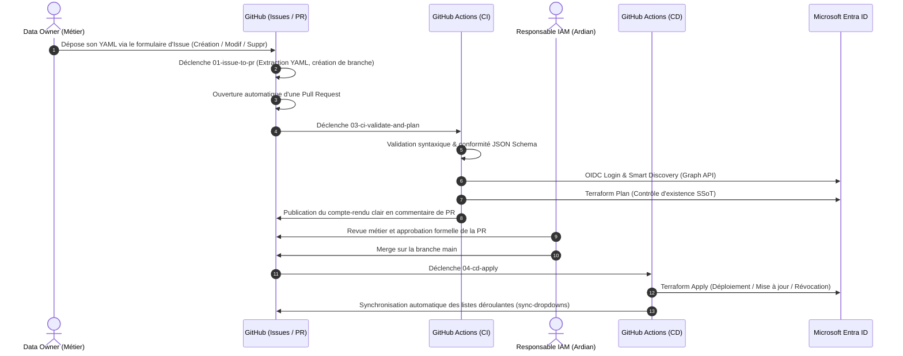

# Document d'Architecture Technique (HLD) & Stratégie d'Implémentation
## Industrialisation GitOps de l'Entitlement Management Entra ID — Ardian

---

### Informations Générales

| Métadonnée | Valeur |
|---|---|
| **Client** | Ardian |
| **Projet** | Automatisation & Gouvernance des Accès Entra ID (Identity Governance) |
| **Document** | High-Level Design (HLD) & Stratégie de Déploiement Cible |
| **Auteur** | Équipe Architecture IAM / Cloud Platform |
| **Statut** | En attente de validation client (Architecture Review Board) |
| **Version** | 1.0 — Post-POC & Validation Lab |

---

## 1. Contexte & Enjeux Métier Ardian

Ardian gère un écosystème complexe d'applications d'entreprise (CRM, ERP, solutions d'investissement, outils collaboratifs). L'octroi et la révocation des accès doivent répondre à de fortes exigences réglementaires (SOX, RGPD, ISO 27001) imposant :
1. **Le principe du moindre privilège** et l'accès juste-à-temps (*Just-in-Time*).
2. **La séparation stricte des rôles** entre les propriétaires des données (*Data Owners*) et les équipes d'administration IAM.
3. **Une auditabilité totale** : chaque demande, approbation, attribution et revue périodique d'accès doit être traçable, datée et horodatée.
4. **Une standardisation sans friction** : simplifier la vie des métiers sans les exposer à la complexité technique de Terraform ou des API Azure.

La solution conçue lors du lab implémente un modèle **GitOps Déclaratif** : un simple fichier YAML par application pilote automatiquement les **Catalogues**, **Access Packages**, **Ressources** et **Politiques d'assignation** dans Microsoft Entra ID.

---

## 2. Principes d'Architecture & Décisions Clés

Ce tableau résume les choix d'ingénierie soumis à l'approbation du client Ardian :

| Réf | Sujet | Choix retenu | Justification & Bénéfice client |
|:---|:---|:---|:---|
| **AD-01** | **Approche de modélisation** | `1 Application = 1 Fichier YAML = 1 Catalogue` | Isolation totale des périmètres applicatifs. Pas d'effet de bord entre applications lors des déploiements. |
| **AD-02** | **Source Unique de Vérité (SSoT)** | **Entra ID est la SSoT absolue**, Git est le référentiel d'intentions | Terraform n'essaie jamais de réinventer l'existant. Si un groupe manque dans Entra ID, le déploiement échoue immédiatement. |
| **AD-03** | **Mode Consommateur Strict** | Consommation passive via `data` sources | Évite que Terraform ne crée ou ne modifie des groupes de sécurité ou des Enterprise Apps hors de son scope de gouvernance. |
| **AD-04** | **Authentification CI/CD** | **Zero-Secret : OIDC (Workload Identity Federation)** | Aucun secret client (mot de passe ou certificat) stocké dans GitHub. Conforme aux standards ANSSI / CIS Benchmark. |
| **AD-05** | **Gestion des Catalogues Existants** | **Smart Discovery & Auto-Import dynamique** | Détection automatique des catalogues existants via Graph API, évitant aux métiers d'avoir à spécifier des flags techniques (`existing: true`) ou des UUIDs. |
| **AD-06** | **Expérience Métier (UX)** | GitHub Issue Forms + Drag & Drop de fichier YAML | L'utilisateur n'écrit pas de code brut dans le formulaire, il glisse-dépose son YAML. Les formulaires sont automatiquement mis à jour. |
| **AD-07** | **Stockage du State Terraform** | Azure Blob Storage avec verrouillage OIDC natif | State chiffré au repos (SSE/CMK), accès réseau restreint, protection contre les concurrences d'accès (Blob Lease). |

---

## 3. Implémentation d'Entra ID en tant que SSoT (Single Source of Truth)

L'un des défis majeurs dans l'automatisation d'Entra ID Identity Governance est d'éviter les collisions entre la réalité du tenant et le référentiel de code. Dans notre architecture, **Entra ID fait toujours autorité**.

### 3.1. Le "Mode Consommateur Strict"
- **Principe** : Terraform ne provisionne ni les utilisateurs, ni les groupes de sécurité, ni les Enterprise Apps. Ces objets relèvent d'autres processus IAM (ex: synchronisation HR/Workday, provisioning SCIM).
- **Implémentation technique** : Toutes les références aux groupes dans les fichiers YAML sont résolues via des blocs Terraform `data "azuread_group" "all"`.
- **Garantie SSoT** : Si un Data Owner référence dans son YAML un groupe `GRP-APP-Salesforce-Users` qui n'a pas été préalablement créé et validé dans Entra ID, la phase `terraform plan` de la CI s'interrompt instantanément avec une erreur explicite. **Aucun état corrompu ne peut être poussé.**

### 3.2. Le mécanisme "Smart Discovery" & Imports Dynamiques
- **Problématique constatée sur le terrain** : Si un catalogue (ex: `Cat_Test01`) existe déjà dans Entra ID (créé manuellement ou hérité), ou si un groupe y a déjà été ajouté en tant que ressource, l'API Entra ID rejette la création avec une erreur HTTP 409 (`already exists`).
- **Solution mise en œuvre** :
  1. Avant le `terraform plan`, un script d'introspection ([`discover-catalogs.py`](file:///C:/Users/Bayano/Desktop/ardian-entitlement-mgmt/.github/scripts/discover-catalogs.py)) interroge l'API Microsoft Graph (`/v1.0/identityGovernance/entitlementManagement/catalogs`).
  2. Le script compare les noms de façon **insensible à la casse** (`cat_test01` == `Cat_Test01`).
  3. Si le catalogue existe, le script identifie également les ressources déjà rattachées au catalogue (`originId`).
  4. Il génère à la volée un fichier `terraform/imports.tf` contenant des blocs `import {}` (Terraform 1.5+).
- **Résultat** : L'infrastructure s'aligne automatiquement sur l'état réel du tenant sans intervention manuelle et sans exiger des utilisateurs qu'ils apprennent des identifiants techniques complexes.

### 3.3. Prévention du Drift (Dérive de configuration)
Lors de chaque exécution, Terraform compare le state local avec les objets distants dans Entra ID. Si une modification non autorisée est réalisée hors-bande (ex: suppression manuelle d'une politique dans le portail Azure), le prochain run CD la réconcilie automatiquement pour restaurer la configuration déclarée dans Git.

---

## 4. Architecture Fonctionnelle & Cycle de Vie GitOps

Le cycle de vie complet repose sur une expérience simplifiée pour les équipes métier et un contrôle rigoureux pour les équipes de sécurité.

### 4.1. Parcours Utilisateur Dédiés

1. **Création d'une application** :
   - Le demandeur utilise le formulaire **🆕 Créer un Access Package**.
   - Il dispose d'un mini-tutoriel et d'un lien vers le modèle [`_example.yaml`](file:///C:/Users/Bayano/Desktop/ardian-entitlement-mgmt/declarations/apps/_example.yaml).
   - Il renseigne le nom d'application et glisse-dépose son fichier YAML (aucun copier/coller de code source).
   - Il fournit une justification métier et valide la checklist de conformité.
2. **Modification d'une application** :
   - Le demandeur utilise le formulaire **✏️ Modifier un Access Package**.
   - Un **menu déroulant dynamique** lui permet de sélectionner l'application cible parmi celles existantes.
   - Il glisse-dépose la version révisée de son fichier YAML et décrit les changements.
3. **Suppression / Décommissionnement** :
   - Le formulaire **🗑️ Supprimer un Access Package** permet de sélectionner l'application à retirer.
   - Une confirmation explicite est requise.
   - Le workflow supprime le fichier dans Git (`git rm`), et Terraform détruit proprement les ressources associées dans Entra ID lors du merge.

---

## 5. Architecture de Sécurité & Conformité

### 5.1. Authentification Zero-Trust via GitHub OIDC
L'authentification entre GitHub Actions et le tenant Entra ID d'Ardian n'utilise **aucun secret longue durée** :
- Une **Federated Identity Credential** (App Registration) est configurée dans Entra ID.
- GitHub Actions émet un jeton OIDC signé cryptographiquement (`ACTIONS_ID_TOKEN_REQUEST_URL`).
- Azure valide l'émetteur (`https://token.actions.githubusercontent.com`), le subject (`repo:Ardian/<repo>:ref:refs/heads/main` ou `pull_request`) et l'audience (`api://AzureADTokenExchange`).
- Aucun risque de fuite d'identifiants dans les logs ou les repositories.

### 5.2. Moindre Privilège & Rôles Requis
L'App Registration dédiée à l'automatisation GitOps ne dispose que des permissions strictement nécessaires à la gestion de la gouvernance des accès :
- **Rôle applicatif Microsoft Graph** : `EntitlementManagement.ReadWrite.All`
- **Lecture d'annuaire (Directory Read)** : `Group.Read.All`, `Application.Read.All`
- **Séparation des tâches** : L'application de déploiement ne peut pas créer d'utilisateurs ni modifier des stratégies d'accès conditionnel globales.

### 5.3. Sécurisation du State Terraform
- **Backend distant** : Azure Storage Account dédié (`stardiantfstate`), isolé dans un Resource Group réservé à l'équipe plateforme (`rg-terraform-state`).
- **Contrôle d'accès** : Rôle RBAC Azure `Storage Blob Data Contributor` restreint à l'identité managée / OIDC du pipeline.
- **Chiffrement** : Chiffrement AES-256 natif au repos (avec option Customer-Managed Keys si exigé par la politique de sécurité Ardian).

---

## 6. Stratégie d'Implémentation chez Ardian (Roadmap)

Le déploiement industriel sur les environnements Ardian est structuré en 4 phases progressives :

### Phase 1 : Cadrage & Préparation des Pré-requis Azure (Semaine 1)
- [ ] Création du Resource Group et du Storage Account pour le state Terraform distant.
- [ ] Création de l'App Registration Azure AD et configuration de la fédération d'identité OIDC avec le repository GitHub de production d'Ardian.
- [ ] Attribution des privilèges Microsoft Graph (`EntitlementManagement.ReadWrite.All`, `Group.Read.All`).
- [ ] Revue par l'équipe Sécurité/Cloud Platform d'Ardian.

### Phase 2 : Déploiement de l'Usine GitOps (Semaine 2)
- [ ] Initialisation du repository GitHub Enterprise / Organisation Ardian.
- [ ] Configuration des secrets d'environnement OIDC (`AZURE_CLIENT_ID`, `AZURE_TENANT_ID`, etc.).
- [ ] Mise en place des règles de protection de branche (`main` : revue obligatoire, merge restreint, passage de CI requis).
- [ ] Déploiement des workflows GitHub Actions et des formulaires d'Issues validés lors du lab.

### Phase 3 : Applications Pilotes & Recette Fonctionnelle (Semaines 3 - 4)
- [ ] Sélection de 2 ou 3 applications pilotes représentatives chez Ardian (ex: 1 catalogue existant avec groupes pré-associés, 1 nouveau catalogue simple, 1 catalogue avec double approbation).
- [ ] Rédaction des fichiers YAML correspondants avec les Data Owners concernés.
- [ ] Validation du cycle complet de demande (Issue ➔ PR ➔ Approbation Data Owner ➔ Apply).
- [ ] Vérification de l'expérience utilisateur finale sur le portail [MyAccess](https://myaccess.microsoft.com).

### Phase 4 : Généralisation & Gouvernance du Run (Semaine 5+)
- [ ] Publication du guide opérationnel et formation des Data Owners.
- [ ] Onboarding progressif des autres applications de l'entreprise.
- [ ] Activation des revues d'accès automatiques dans Entra ID.

---

## 7. Matrice de Validation Client (Checklist Ardian)

Ce document est soumis pour arbitrage aux différentes parties prenantes :

| Sujet soumis à validation | Interlocuteur Ardian | Statut | Commentaire / Décision |
|---|---|:---:|---|
| **Architecture GitOps Déclarative (1 YAML = 1 App)** | Enterprise Architect | 🟡 En attente | Validation du découpage applicatif |
| **Principe SSoT & Mode Consommateur** | Lead IAM | 🟡 En attente | Confirmation que les groupes sont gérés en amont |
| **Authentification OIDC sans secret** | RSSI / Sécurité Cloud | 🟡 En attente | Validation de la fédération OIDC GitHub-Azure |
| **Périmètre des droits Graph API** | Administrateur Global Entra | 🟡 En attente | Octroi du rôle `EntitlementManagement.ReadWrite.All` |
| **Emplacement du State Backend** | Responsable Azure Platform | 🟡 En attente | Choix du Storage Account et de la région Azure |
| **Workflow d'approbation des PRs** | Responsables Métiers / Data Owners | 🟡 En attente | Validation de la gouvernance par pull request |
