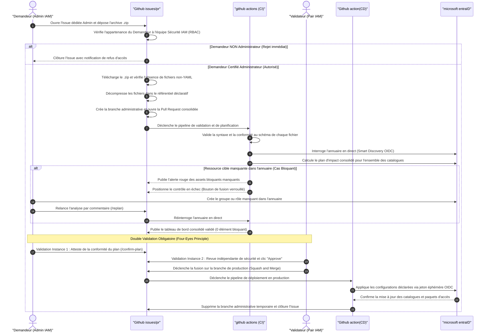
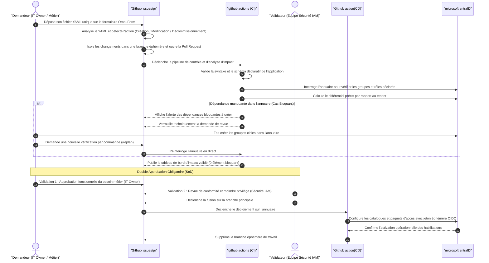

# High-Level Design (HLD) — Processus de Modification en Masse & Gouvernance à Double Validation
## Industrialisation GitOps de l'Entitlement Management Microsoft Entra ID
### Ardian — Architecture Cloud IAM & Sécurité des Accès

---

| Métadonnée | Valeur |
|:---|:---|
| **Client** | Ardian |
| **Projet** | Industrialisation & Automatisation GitOps de l'Identity Governance Entra ID |
| **Document** | HLD Spécifique — Processus de Modification en Masse & Double Validation Humaine |
| **Rôle / Auteur** | Architecte Cloud IAM & DevOps Platform |
| **Destinataires** | Architecture Review Board, Équipe Sécurité IAM, Auditeurs Conformité |
| **Statut** | **Spécification Validée pour Implémentation** |
| **Version** | 2.0 (Double Validation 4-Eyes, Import ZIP Sécurisé & Mode Consommateur) |

---

## 1. Synthèse Exécutive & Principes Fondateurs

Le présent document formalise la conception technique du **processus de modification en masse**, conçu spécifiquement pour les administrateurs IAM d'Ardian devant appliquer des modifications transverses sur plusieurs catalogues applicatifs en une seule opération coordonnée (ex: départ d'un responsable nécessitant la mise à jour de son email d'approbateur sur 15 applications distinctes).

### Fin de l'Auto-Approbation : Instauration de la Règle des 4 Yeux (*Four-Eyes Principle*)
Pour répondre aux exigences réglementaires strictes de séparation des tâches (SOX, ISO 27001), **l'auto-approbation technique est formellement exclue de ce scénario**. 

Toute modification en masse impose obligatoirement **deux instances de validation humaine distinctes et successives** :
1. **Instance 1 (Le Demandeur)** : L'administrateur ayant préparé et soumis le lot examine le résultat du plan d'exécution généré par la CI et atteste formellement de son adéquation avec l'intention initiale.
2. **Instance 2 (Le Validateur)** : Un second membre de l'équipe Sécurité IAM (un pair distinct) effectue la revue de sécurité indépendante, appose l'approbation formelle sur la Pull Request et autorise le déploiement en production.

```
┌────────────────────────────────────────────────────────────────────────────────────────┐
│                   DOUBLE VALIDATION OBLIGATOIRE DU RUN EN MASSE                        │
├────────────────────────────────────────┬───────────────────────────────────────────────┤
│  VALIDATION INSTANCE 1 : DEMANDEUR     │  VALIDATION INSTANCE 2 : PAIR IAM VALIDATEUR  │
├────────────────────────────────────────┼───────────────────────────────────────────────┤
│  • Vérification du plan consolidé      │  • Contrôle de conformité de sécurité         │
│  • Confirmation formelle d'adéquation  │  • Vérification de l'absence de droits abusifs│
│  • Validation de premier niveau        │  • Clic d'approbation formelle GitHub & Merge │
└────────────────────────────────────────┴───────────────────────────────────────────────┘
```

---

## 2. Déroulement du Processus Pas-à-Pas (De Bout en Bout)

Le processus repose sur une interface web sans friction via une **Issue GitHub dédiée aux administrateurs**, acceptant le dépôt d'une archive `.zip` contenant l'ensemble des fichiers YAML modifiés.

```
┌─────────────────┐      ┌─────────────────┐      ┌─────────────────┐      ┌─────────────────┐      ┌─────────────────┐
│ 1. Dépôt du ZIP │ ───> │ 2. Contrôle RBAC│ ───> │ 3. Extraction & │ ───> │ 4. Contrôle CI  │ ───> │ 5. Double Revue│
│ par l'Admin     │      │ & Filtrage      │      │ Ouverture PR    │      │ & Plan SSoT     │      │ & Déploiement CD│
└─────────────────┘      └─────────────────┘      └─────────────────┘      └─────────────────┘      └─────────────────┘
```

### Étape 2.1 : Dépôt de l'Archive dans l'Issue Dédiée
* L'administrateur prépare les fichiers YAML modifiés sur son poste local (`declarations/apps/*.yaml`).
* Il compresse ces fichiers dans une archive standard `.zip`.
* Il accède au formulaire d'Issue réservé : **`[ADMIN ONLY] ⚡ Modification en Masse (Import ZIP)`**.
* Il renseigne la justification de l'opération et glisse-dépose son archive `.zip` directement dans le formulaire.

### Étape 2.2 : Sas de Contrôle d'Accès RBAC & Vérification de Sécurité
Dès la création de l'Issue, un workflow de sécurité s'exécute immédiatement :
1. **Contrôle d'Habilitation RBAC** : Le workflow interroge l'API GitHub pour vérifier si l'auteur de l'Issue appartient bien à l'équipe `@ardian/cloud-iam-team` (ou dispose du rôle administrateur sur le dépôt).
   * *Si l'auteur n'est pas autorisé* : L'Issue est **immédiatement clôturée** avec un message d'alerte et l'opération est avortée sans aucune extraction.
2. **Téléchargement & Audit du ZIP** :
   * Le fichier est téléchargé de façon sécurisée via jeton GitHub éphémère.
   * Une inspection anti-malware et anti-traversée de répertoire (*anti Zip-Slip*) est exécutée.
   * Le contenu est filtré : **l'archive ne doit contenir que des fichiers `.yaml` ou `.yml`**.

### Étape 2.3 : Extraction, Branche Administrative & Ouverture Automatique de PR
1. Les fichiers YAML sont extraits et appliqués dans le répertoire `declarations/apps/`.
2. Le workflow crée une branche administrative dédiée : `admin/bulk-zip-<horodatage>`.
3. Il enregistre un commit Git signé attestant de l'identité de l'administrateur demandeur.
4. Il ouvre **automatiquement une unique Pull Request consolidée** ciblant la branche `main` :
   * **Titre** : `[Admin Bulk] Modification groupée (Issue #N)`
   * **Lien bidirectionnel** : Référence l'Issue d'origine (`Closes #N`).

### Étape 2.4 : Pipeline CI, Smart Discovery & Plan Consolidé
Dès l'ouverture de la PR, le pipeline d'intégration continue prend le relais :
1. **Détection différentielle** : Isole la liste exacte des applications touchées par l'archive.
2. **Validation unitaire de syntaxe** : Chaque fichier extrait est validé contre `schemas/app-declaration.schema.json`.
3. **Smart Discovery Graph API (OIDC)** : Interroge Microsoft Entra ID pour chaque catalogue impacté, génère les adoptions dynamiques (`imports.tf`) et vérifie que toutes les ressources cibles existent.
4. **Calcul du Plan Terraform Consolidé** : Génère le différentiel complet pour l'ensemble des applications du lot.
5. **Publication du Tableau de Bord Consolidé** : Affiche dans la PR une synthèse globale suivie du détail dépliant par application.

### Étape 2.5 : Le Double Sas de Validation Humaine
1. **Validation 1 (Le Demandeur)** : L'administrateur auteur examine le tableau de bord de la PR. Il atteste de la conformité du plan consolidé en postant le commentaire certifié `/confirm-plan` (ou en cochant la case formelle d'auto-vérification).
2. **Validation 2 (Le Validateur Pair IAM)** : Un second membre de l'équipe Sécurité IAM examine les modifications, vérifie qu'aucun privilège excessif n'a été introduit, appose son approbation formelle GitHub (*Approve*), et procède au déclenchement du merge (*Squash and Merge*).

### Étape 2.6 : Déploiement CD & Finalisation
1. Le merge sur `main` déclenche le pipeline de déploiement continu.
2. Le pipeline s'authentifie sur Microsoft Entra ID via OIDC (secret-less) et applique les configurations déclarées.
3. La branche administrative temporaire est automatiquement supprimée.
4. L'Issue initiale est automatiquement marquée comme résolue et clôturée.

---

## 3. Gestion des Erreurs & Mode Consommateur Strict

Le respect du **Mode Consommateur Strict** demeure intangible : **le pipeline ne crée jamais de groupe de sécurité, de rôle applicatif ou de site SharePoint dans Entra ID**.

```
┌────────────────────────────────────────────────────────────────────────────────────────┐
│                        MATRICE DE GESTION DES ANOMALIES                                │
├──────────────────────────────┬──────────────────────────────┬──────────────────────────┤
│ TYPE D'ANOMALIE              │ DÉTECTION & COMPORTEMENT     │ ACTION CORRECTIVE        │
├──────────────────────────────┼──────────────────────────────┼──────────────────────────┤
│ 1. Tentative d'accès par     │ Rejet immédiat par le sas    │ Aucune. La demande est   │
│ un utilisateur non-admin     │ RBAC. Clôture de l'Issue     │ verrouillée et tracée    │
│                              │ en moins de 10 secondes.     │ dans les logs d'audit.   │
├──────────────────────────────┼──────────────────────────────┼──────────────────────────┤
│ 2. Archive corrompue ou      │ Échec lors de l'inspection.  │ L'admin doit corriger son│
│ contenant des scripts (.sh)  │ Rejet avant extraction.      │ archive et ne soumettre  │
│                              │ Alerte déposée sur l'Issue.  │ que des fichiers .yaml.  │
├──────────────────────────────┼──────────────────────────────┼──────────────────────────┤
│ 3. Erreur de syntaxe YAML    │ Échec lors du job de CI      │ L'admin corrige le YAML  │
│ sur une des applications     │ `validate-schema`. Le plan   │ en local et redépose son │
│                              │ Terraform n'est pas lancé.   │ archive corrigée.        │
├──────────────────────────────┼──────────────────────────────┼──────────────────────────┤
│ 4. Ressource manquante       │ **BLOQUANT STRICT** :        │ 1. L'admin crée l'actif  │
│ dans Entra ID pour l'une     │ L'application fautive est    │ dans Entra ID.           │
│ des applications du lot      │ signalée en rouge. Le bouton │ 2. Il commente `/replan` │
│                              │ de fusion reste verrouillé.  │ sur la PR sans ré-upload.│
└──────────────────────────────┴──────────────────────────────┴──────────────────────────┘
```

### Le Cas Critique : Dépendance Manquante dans Entra ID
Si sur un lot de 5 applications, l'application `sap-s4hana` référence un groupe `GRP-SAP-Admins` introuvable dans Entra ID :
1. Le pipeline CI identifie l'anomalie et classe l'élément en **`🚫 Asset bloquant à créer avant de lancer le merge`**.
2. Le job CI se termine en code d'erreur (`exit 1`), provoquant l'échec du statut GitHub de la PR.
3. **Verrouillage de la fusion** : Le bouton de merge est physiquement inaccessible pour tout le monde.
4. **Procédure de déblocage sans friction** :
   * L'administrateur se rend sur le portail Microsoft Entra ID et crée le groupe manquant.
   * Il retourne sur la PR et commente simplement : `/replan`.
   * Le pipeline CI réinterroge Entra ID, constate la présence du groupe, recalcule le plan qui passe à 0 élément bloquant, et déverrouille le sas d'approbation.

---

## 4. Diagramme de Séquence Détaillé — Scénario de Modification en Masse

Ce diagramme illustre le flux complet de modification en masse avec dépôt de ZIP et double validation humaine :



---

## 5. Diagramme de Séquence Détaillé — Scénario Utilisateur Simple (Omni-Form)

Ce diagramme illustre le flux unitaire standard utilisé au quotidien par les propriétaires d'applications métiers (IT Owners / Data Owners), structuré selon la même rigueur de contrôle :



---

## 6. Synthèse des Garanties Opérationnelles

| Exigence Métier Ardian | Réponse Technique Documentée |
|:---|:---|
| **Fin de l'Auto-Approbation** | Remplacement de tout mécanisme d'auto-approbation par une **double validation humaine obligatoire** (Demandeur ➔ Validateur Pair IAM). |
| **Simplicité de Dépôt en Masse** | Dépôt d'un simple fichier `.zip` via une Issue dédiée, sans manipulation de commandes Git complexes sur le poste client. |
| **Sécurité d'Accès au Formulaire** | Sas de contrôle RBAC à l'ouverture de l'Issue fermant instantanément toute demande émanant d'un utilisateur non-administrateur. |
| **Contrôle Strict des Dépendances** | Maintien absolu du **Mode Consommateur** : blocage immédiat de la PR si un groupe ou rôle manque dans Entra ID, avec relance facilitée via `/replan`. |
| **Traçabilité Complète (Audit)** | Historique inaltérable liant l'archive source, les rapports de calculs intermédiaires, les approbations nominatives et le commit de déploiement. |
