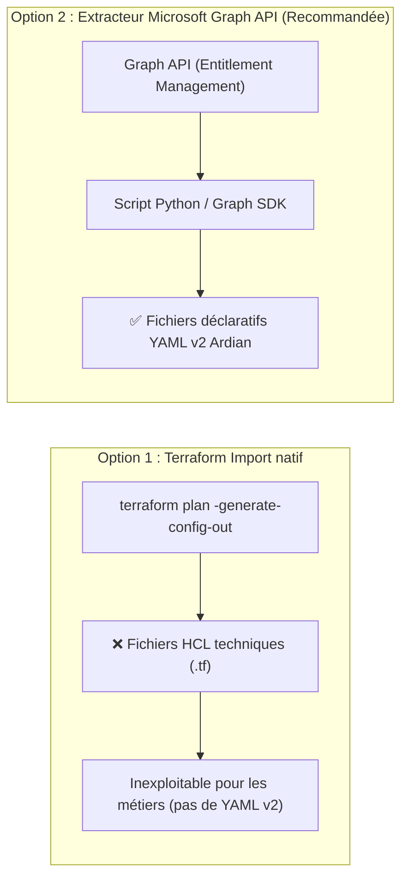
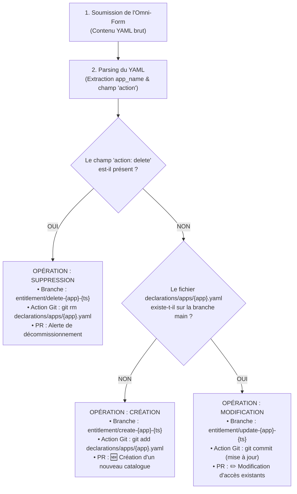

# Spécifications Techniques & Orientations de Design — Version 1.0 (V1)
## Modèle Opérationnel Cible "Run" — Entitlement Management Entra ID sous GitOps
### Ardian — Architecture Cloud IAM & Sécurité des Accès

---

| Métadonnée | Valeur |
|:---|:---|
| **Client** | Ardian |
| **Projet** | Industrialisation GitOps de l'Identity Governance Microsoft Entra ID |
| **Document** | Spécifications Techniques d'Architecture & Nouveaux Scénarios de Design (V1) |
| **Rôle / Auteur** | Architecte Cloud IAM & DevOps Platform |
| **Destinataires** | Architecture Review Board, Équipes IAM, Lead DevOps & Security Ardian |
| **Statut** | **Spécification V1 — Validée pour Implémentation** |
| **Version** | 1.0 |

---

## Synthèse & Contexte

À la suite de la réalisation et de la validation du Lab d'automatisation de l'Entitlement Management Entra ID, ce document formalise les **spécifications techniques d'ingénierie et d'architecture** pour répondre aux 6 exigences opérationnelles du modèle cible d'Ardian :

1. **Séparation User / Admin & Modification en masse** (Workflow d'administration unifié).
2. **Workflow de validation à 3 niveaux** (Sas automatique, sas bloquant ressources, double approbation humaine).
3. **Gouvernance via `CODEOWNERS`** (Restriction des droits et approbation déléguée par application).
4. **Rétro-ingénierie / Reverse Engineering** (Aspiration de l'existant Entra ID à $T_0$).
5. **Formulaire Unique (Omni-Form)** (Point d'entrée unique sans saisie manuelle de métadonnées).
6. **Complémentarité Smart Discovery vs Terraform Plan** (Démystification technique).

---

## 1. Séparation User / Admin & Modifications en Masse (*Bulk Operations*)

### 1.1. Expression du Besoin
* **Utilisateurs Métiers (Data / IT Owners)** : Continuent d'effectuer des opérations unitaires (1 application à la fois via le formulaire unique).
* **Administrateurs IAM** : Doivent pouvoir réaliser des modifications transverses en masse sur plusieurs fichiers YAML simultanément (ex: mise à jour du nom ou de l'email d'un approbateur ayant quitté l'entreprise sur 15 catalogues distincts).
* **Contrainte d'architecture** : Conserver le principe fondamental `1 application = 1 fichier déclaratif YAML`, tout en agrégeant les modifications dans **une seule Pull Request** pour simplifier et centraliser la revue de sécurité.

### 1.2. Analyse Comparative des Solutions de Modification en Masse

| Critère | Option A : Script Local (PowerShell / Bash) | Option B : Workflow Dédié GitHub Actions (`admin-bulk-ops.yml`) *(Recommandée)* |
|:---|:---|:---|
| **Pré-requis sur poste** | Git, PowerShell, droits de clone local et push. | **Aucun** (interface web GitHub). |
| **Sécurité & Traçabilité** | Risque d'erreur de syntaxe locale, historique de branche disparate. | **Audit trail complet** dans GitHub Actions, permissions RBAC restreintes aux administrateurs. |
| **Processus de PR** | L'administrateur doit pousser la branche et ouvrir manuellement la PR. | **Génération 100% automatique** de la branche et de la Pull Request consolidée. |
| **Vitesse d'exécution** | Dépend de la machine locale. | Exécution immédiate sur runner managé avec validation CI instantanée. |

### 1.3. Architecture Technique Retenue : Workflow `admin-bulk-ops.yml`
1. **Déclenchement (`workflow_dispatch`)** :
   Le workflow est accessible uniquement aux membres du groupe `@ardian/cloud-iam-team`. Il expose des paramètres standardisés :
   * `target_field` : champ à modifier (ex: `authorization_owners`, `env`, `privilege_level`).
   * `search_value` : valeur actuelle à rechercher (ex: `old.owner@ardian.com`).
   * `replace_value` : nouvelle valeur de remplacement (ex: `new.owner@ardian.com`).
   * `app_filter` : `all` ou liste d'applications spécifiques (séparées par virgule).

2. **Moteur de modification (Runner GitHub)** :
   * Un script Python ou `yq` inspecte l'arborescence `declarations/apps/*.yaml`.
   * Il remplace les valeurs ciblées en préservant l'indentation, les commentaires et la structure conforme au schéma JSON v2.
   * Il enregistre la liste exhaustive des fichiers modifiés.

3. **Gestion de la PR Unique multi-applications** :
   * Le bot crée une branche administrative unique : `admin/bulk-update-owners-<YYYYMMDD-HHMMSS>`.
   * Il commite l'ensemble des fichiers modifiés dans cette branche.
   * Il ouvre **une unique Pull Request** intitulée `[Admin Bulk] Mise à jour de <target_field> (<N> applications impactées)`.
   * **Dans la CI** : Le script de validation détecte tous les fichiers touchés via `git diff --name-only origin/main...HEAD`, valide unitairement chaque fichier contre le schéma v2, exécute la *Smart Discovery* sur chaque catalogue, et calcule un `terraform plan` consolidé.
   * **Bénéfice** : L'équipe IAM effectue **une seule revue globale** et **un seul merge**, tout en maintenant l'isolation stricte par fichier.

---

## 2. Le Workflow de Validation à 3 Niveaux

Le cycle de validation garantit la sécurité opérationnelle et empêche tout déploiement corrompu ou incomplet.

```
┌─────────────────────────────────┐
│          VALIDATION 1           │  Automatique (CI)
│  Syntaxe & Conformité Schéma v2 │  Bloquant technique (exit 1 si invalide)
└────────────────┬────────────────┘
                 │
                 ▼
┌─────────────────────────────────┐
│          VALIDATION 2           │  IT Owner / Demandeur
│   Détection Dépendances SSoT    │  Vérification de l'existence des actifs cibles
│ (Groupes, App Roles, SP Sites)  │  Bloquant technique si ressource absente
└────────────────┬────────────────┘
                 │
                 ▼
┌─────────────────────────────────┐
│          VALIDATION 3           │  IT Owner + Responsable IAM
│     Double Approbation Merge    │  Validation formelle SoD avant Terraform Apply
└─────────────────────────────────┘
```

### 2.1. Validation 1 — Automatique (CI)
* Contrôle syntaxique et validation structurelle stricte via `schemas/app-declaration.schema.json`.
* Si un champ obligatoire manque ou si le format d'un email est incorrect, le job `validate-schema` échoue immédiatement. Aucun appel n'est émis vers Entra ID.

### 2.2. Validation 2 — IT Owner & Détection Bloquante des Ressources
* **Comment rendre cette étape techniquement bloquante ?**
  1. Lors du step de *Smart Discovery* et d'exécution du plan Terraform, les blocs `data` interrogent Microsoft Entra ID pour chaque ressource déclarée (`EntraID Group`, `Application Role`, `Sharepoint Group`).
  2. Si un actif est introuvable :
     * Le rapport CI classe l'asset dans la section d'alerte :
       `### 🚫 Assets bloquants à créer avant de lancer le merge :`
     * Le script positionne une variable `has_blocking_assets=true` et termine le step avec `exit 1`.
     * Le GitHub Check de la PR passe à l'état **Échec (Failed ❌)**.
     * La règle de protection de branche (`Branch Protection Rule` sur `main` avec `Require status checks to pass before merging`) **grise et verrouille physiquement le bouton "Merge"**. Aucun utilisateur ne peut forcer le déploiement.
* **Comment relancer la PR une fois l'asset créé dans Entra ID (SANS resoumettre le YAML) ?**
  Dès que l'administrateur a provisionné le groupe ou le rôle manquant dans Entra ID :
  * **Option 1 (Native GitHub UI)** : Le demandeur clique sur le bouton **"Re-run failed jobs"** (ou "Re-run all jobs") dans l'onglet *Checks* de la PR.
  * **Option 2 (ChatOps — Expérience fluide sans friction)** :
    * Un workflow léger `pr-chatops.yml` écoute l'événement `on: issue_comment`.
    * Le demandeur poste simplement un commentaire `/replan` ou `/check` dans la PR.
    * Le workflow redéclenche automatiquement le pipeline de validation. La CI réinterroge Entra ID via OIDC, constate que le groupe est désormais présent, génère un plan avec $0$ ressource bloquante, et passe le Check au vert (✅).

### 2.3. Validation 3 — IT Owner + IAM : Double Approbation Formelle avant Merge
Pour exiger techniquement les deux approbations distinctes :
1. **Via GitHub Branch Protection & CODEOWNERS** :
   * Activation de `Require pull request reviews before merging` avec `Required approvals: 2`.
   * Activation de l'option stricte `Require review from Code Owners`.
   * Le fichier `CODEOWNERS` attribue la propriété du fichier modifié au groupe métier (`@ardian/it-owners-<app>`) et à l'équipe sécurité (`@ardian/cloud-iam-team`).
   * **Conséquence** : Le bouton de merge reste bloqué tant qu'au moins un membre de chacune de ces deux équipes n'a pas formellement cliqué sur "Approve".
2. **Via GitHub Deployment Environments (Sécurité renforcée au niveau CD)** :
   * Le job de déploiement `04-cd-apply` est associé à l'environnement GitHub `production-entraid`.
   * Cet environnement est configuré avec des **Required Reviewers** :
     - Équipe IT Owner de l'application
     - Équipe Sécurité IAM
   * Le runner suspend l'exécution de `terraform apply` jusqu'à validation solennelle dans l'interface de déploiement GitHub.

---

## 3. La Gouvernance via le Fichier `CODEOWNERS`

### 3.1. Définition et Rôle Général
Le fichier `.github/CODEOWNERS` est un mécanisme de sécurité natif de GitHub permettant de définir formellement les individus ou équipes responsables de parties spécifiques d'un référentiel de code.
* À l'ouverture d'une Pull Request modifiant un fichier sous gouvernance :
  1. GitHub assigne automatiquement les propriétaires désignés en tant que réviseurs obligatoires.
  2. Aucune fusion sur la branche protégée n'est autorisée sans leur approbation explicite.

### 3.2. Implémentation dans l'Usine GitOps Ardian
Dans notre architecture, `CODEOWNERS` est structuré en cascade pour isoler les responsabilités techniques et métiers :

```text
# ==============================================================================
# 1. RÈGLE GLOBALE (CATCH-ALL) : ÉQUIPE CENTRALE CLOUD IAM
# ==============================================================================
*                                         @ardian/cloud-iam-team

# ==============================================================================
# 2. SOCLE TECHNIQUE & WORKFLOWS : RESTREINT STRICTEMENT À L'IAM
# ==============================================================================
.github/                                  @ardian/cloud-iam-team
terraform/                                @ardian/cloud-iam-team
schemas/                                  @ardian/cloud-iam-team
scripts/                                  @ardian/cloud-iam-team

# ==============================================================================
# 3. GOUVERNANCE PAR APPLICATION (DECLARATIONS/APPS/)
# ==============================================================================
# Chaque application nécessite la double validation de son IT Owner ET de l'IAM :
declarations/apps/catalogue-test-v1.yaml   @ardian/it-owners-test       @ardian/cloud-iam-team
declarations/apps/catalogue-test-v2.yaml   @ardian/it-owners-test       @ardian/cloud-iam-team
declarations/apps/salesforce-crm.yaml     @ardian/it-owners-salesforce @ardian/cloud-iam-team
declarations/apps/sap-s4hana.yaml         @ardian/it-owners-sap        @ardian/cloud-iam-team
```

* **Garantie de Sécurité** : Un Data Owner de *Salesforce* ne peut en aucun cas approuver ni modifier la configuration de *SAP*. La séparation des tâches (*Segregation of Duties - SoD*) est garantie au niveau du commit.

---

## 4. Rétro-Ingénierie (Reverse Engineering) : Récupération de l'Existant

### 4.1. Analyse Comparative des Stratégies



* **Pourquoi Terraform Import est inadapté** : Terraform importe des ressources brutes sous forme de syntaxe HCL (`resource "azuread_access_package" ...`). Il est incapable de reconstruire l'abstraction fonctionnelle du schéma YAML Ardian v2 (`context_subapp`, `privilege_level`, `owner_only`).
* **Stratégie Retenue** : Un **script d'extraction dédié (Python ou PowerShell)** exploitant l'API Microsoft Graph sous authentification OIDC.

### 4.2. Algorithme d'Extraction & Génération Déclarative
1. **Introspection du Tenant** :
   * Interroge l'endpoint `/identityGovernance/entitlementManagement/catalogs` pour lister tous les catalogues non-système.
   * Pour chaque catalogue :
     * Récupère les Access Packages rattachés (`/accessPackages`).
     * Récupère les ressources liées (groupes, rôles d'applications, sites SharePoint) via `/accessPackageResourceRoleScopes`.
     * Récupère les politiques d'assignation (`/accessPackageAssignmentPolicies`).
2. **Reverse-Engineering des Règles Métier Ardian** :
   * Le script décompose le `display_name` des Access Packages (ex: `"SubApp Admin - Dev"`) pour déduire :
     - `context_subapp: "SubApp"`
     - `privilege_level: "Admin"`
     - `env: "Dev"`
   * Il identifie les approbateurs via l'attribut `approverStages` et renseigne `authorization_owners`.
   * Si aucun workflow d'approbation n'est configuré, il positionne `owner_only: true`.
3. **Formatage et Validation Schéma** :
   * Écrit le fichier `declarations/apps/<nom-application-kebab>.yaml`.
   * Valide immédiatement le fichier produit contre `schemas/app-declaration.schema.json`.
4. **Alimentation Git (1 Application = 1 Fichier = 1 Branche)** :
   * Le script crée une branche dédiée par application : `import/{app_name}`.
   * Il commite le fichier YAML et ouvre la Pull Request associée.
   * Au merge de la PR, la *Smart Discovery* lie le catalogue sans aucune interruption de service ni recréation.

---

## 5. Restructuration UX : Le Formulaire Unique (*Omni-Form*)

### 5.1. Le Concept UX
Remplacement des 3 formulaires d'Issues (Création, Modification, Suppression) par **un point d'entrée unique** dans `.github/ISSUE_TEMPLATE/entitlement-management.yml`.

#### Caractéristiques de l'Omni-Form :
* **Zéro saisie redondante** : Le champ "Nom de l'application" est supprimé de l'Issue ; il est extrait dynamiquement du champ `app_name` du fichier YAML déposé.
* **Bloc Didactique Intégré** :
  * Explication claire des 3 règles de traitement :
    - *Nouveau fichier YAML déposé ➔ Création automatique.*
    - *Fichier YAML d'une application existante déposé ➔ Modification automatique.*
    - *Ajout de `action: delete` dans le YAML ➔ Décommissionnement programmé.*
  * Lien direct vers le fichier d'exemple modèle [`_example.yaml`](declarations/apps/_example.yaml).
* **Zone de Dépôt Unique** : Un champ `textarea` (ou upload) acceptant le contenu YAML complet.

### 5.2. Algorithme d'Aiguillage Automatique dans GitHub Actions
Le workflow `01-issue-to-pr.yml` exécute la logique de détection suivante :



* **Fiabilité** : Impossible pour un utilisateur de se tromper de formulaire. L'intention est déduite de façon déterministe par le moteur GitOps.

---

## 6. Clarification Technique : Smart Discovery vs Terraform Plan

### 6.1. Rôles Respectifs et Différences Fondamentales

| Dimension | Smart Discovery (Script Graph API pré-Terraform) | Terraform Plan (Moteur d'Orchestration HashiCorp) |
|:---|:---|:---|
| **Périmètre d'observation** | **L'annuaire Microsoft Entra ID réel** en direct via Graph API (y compris les ressources créées hors Terraform). | **Uniquement le state distant** (`terraform.tfstate`) confronté au code HCL (`.tf`). |
| **Mission principale** | **Introspection et Préparation de l'adoption** :<br>1. Détecte si le catalogue ou les packages existent déjà dans Entra ID.<br>2. Détecte les ressources déjà associées au catalogue.<br>3. Génère dynamiquement `terraform/imports.tf` (`import {}`).<br>4. Vérifie l'existence préalable des groupes et rôles cibles. | **Calcul Différentiel et Idempotence** :<br>1. Compare l'état désiré (YAML) avec l'état importé.<br>2. Calcule les attributs précis à modifier (durée, approbateurs, paramètres).<br>3. Établit le graphe d'exécution ordonné.<br>4. Garantit l'exécution atomique. |
| **Comportement si exécuté SEUL** | **Insuffisant** : Ne sait pas orchestrer, ni gérer les rollbacks, ni maintenir l'idempotence des politiques complexes. | **Échec critique** : Renvoie une erreur `HTTP 409 Conflict (Object already exists)` si le catalogue existe déjà sans être dans le state. |

### 6.2. Peut-on se contenter d'un seul des deux ?
* **NON, ils sont fondamentalement indissociables** :
  * **Sans Smart Discovery** : Terraform est aveugle face aux actifs préexistants dans Azure. Il tente systématiquement de les recréer, provoquant des erreurs 409 ou des destructions intempestives.
  * **Sans Terraform Plan** : Il faudrait coder un moteur de réconciliation complet en Python (gestion de l'état, dépendances, rollbacks, concurrence de verrous), ce qui équivaudrait à réécrire Terraform.
* **Synergie Ardian** : La Smart Discovery prépare le terrain en instruisant Terraform sur l'existant (`import {}`), et Terraform exécute la convergence d'état avec une rigueur absolue.
* **Optimisation de performance** : Le script de Smart Discovery ne scanne que les applications identifiées dans la PR (et non tout l'annuaire de l'entreprise), garantissant une exécution rapide en moins de 30 secondes.

---

## 7. Plan d'Implémentation & Prochaines Étapes

Dès validation de ces spécifications V1 par les équipes Ardian, les développements seront orchestrés selon les étapes suivantes :

1. **Étape 1** : Mise en place de l'Omni-Form (`entitlement-management.yml`) et mise à jour du parseur `01-issue-to-pr.yml`.
2. **Étape 2** : Configuration du fichier `.github/CODEOWNERS` et activation de la double approbation sur la branche `main`.
3. **Étape 3** : Implémentation du ChatOps (`/replan`) et du blocage strict des assets manquants dans `03-ci-validate-and-plan.yml`.
4. **Étape 4** : Développement du workflow d'administration en masse `admin-bulk-ops.yml`.
5. **Étape 5** : Développement et exécution du script de Reverse Engineering pour l'aspiration de l'existant à $T_0$.
