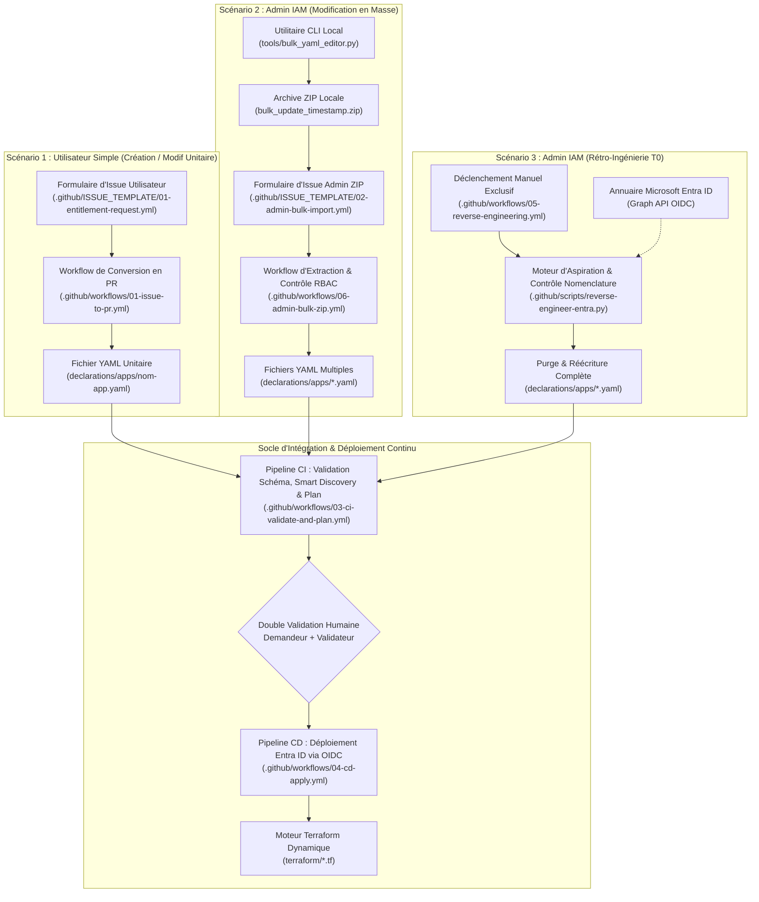

# Structure & Topologie Cible du Référentiel GitHub — GitOps Entitlement Management
## Industrialisation de l'Identity Governance Microsoft Entra ID
### Ardian — Architecture Cloud IAM & DevOps Platform

---

| Métadonnée | Valeur |
|:---|:---|
| **Client** | Ardian |
| **Projet** | Usine GitOps Entitlement Management Microsoft Entra ID |
| **Document** | Cartographie Haute Disponibilité & Structure Détaillée du Dépôt Git |
| **Rôle / Auteur** | Architecte Cloud IAM & DevOps Platform |
| **Destinataires** | Équipes IT & IAM Ardian, DevOps Engineers, Auditeurs de Sécurité |
| **Statut** | **Référence d'Architecture Validée** |
| **Version** | 2.1 (Intégration Import ZIP de Masse & Rétro-Ingénierie $T_0$) |

---

## 1. Vue d'Ensemble & Principes d'Organisation

Le référentiel Git est conçu comme une **usine logicielle déclarative hermétique et sécurisée**. Il sépare rigoureusement :
1. **Le Référentiel Métier Déclaratif** : Les fichiers YAML décrivant les intentions d'accès (catalogues, rôles, approbateurs), accessibles aux contributeurs.
2. **Le Moteur d'Automatisation & Gouvernance** : Les formulaires d'Issues, workflows GitHub Actions et scripts d'audit, exécutés dans des runners isolés.
3. **Le Moteur d'Infrastructure as Code (IaC)** : Le code Terraform dynamique opérant en *Mode Consommateur Strict* via authentification OIDC Zero-Secret.
4. **L'Outillage d'Administration Spécialisé** : Les utilitaires locaux et pipelines dédiés aux deux scénarios privilégiés :
   - **La Modification en Masse** : Dépôt d'une archive `.zip` via une Issue sécurisée avec double validation humaine obligatoire (Règle des 4 yeux).
   - **La Rétro-Ingénierie (*Reverse Engineering*)** : Aspiration manuelle exceptionnelle de l'état réel d'Entra ID pour initialisation ou réalignement à $T_0$.

---

## 2. 🗂️ Arborescence Haute Disponibilité du Référentiel

```text
ardian-entitlement-mgmt/
│
├── .github/                                  # ⚙️ GOUVERNANCE, FORMULAIRES & AUTOMATISATION CI/CD
│   ├── CODEOWNERS                            # Sécurité : Matrice des approbateurs obligatoires par périmètre
│   │
│   ├── ISSUE_TEMPLATE/                       # 📋 Formulaires GitHub (Points d'entrée utilisateurs & admins)
│   │   ├── 01-entitlement-request.yml        # Omni-Form : Formulaire unique utilisateur (Création / Modif / Décommissionnement)
│   │   └── 02-admin-bulk-import.yml          # [ADMIN ONLY] Formulaire de dépôt d'archive ZIP pour modification de masse
│   │
│   ├── workflows/                            # 🚀 Orchestration des pipelines GitHub Actions
│   │   ├── 01-issue-to-pr.yml                # Ingestion : Transforme l'Issue utilisateur en branche et PR unitaire
│   │   ├── 02-download-yaml.yml              # Libre-service : Télécharge le YAML actuel d'une application pour édition
│   │   ├── 03-ci-validate-and-plan.yml       # Intégration Continue : Validation schéma, Smart Discovery & Plan consolidé
│   │   ├── 04-cd-apply.yml                   # Déploiement Continu : Application dans Entra ID au merge sur main (OIDC)
│   │   ├── 05-reverse-engineering.yml        # [ADMIN ONLY] Rétro-Ingénierie manuelle : Aspiration d'Entra ID vers YAML
│   │   └── 06-admin-bulk-zip.yml             # [ADMIN ONLY] Traitement du lot ZIP de masse & ouverture de PR consolidée
│   │
│   └── scripts/                              # 🐍 Moteur d'automatisation exécuté dans les runners GitHub Actions
│       ├── parse-issue-body.py               # Extraction et décodage du YAML soumis dans les formulaires d'Issues
│       ├── process-bulk-zip.py               # Inspection anti-malware, extraction sécurisée anti-traversée et filtrage .yaml
│       ├── validate-schema.py                # Contrôle de conformité formelle au contrat JSON Schema v2
│       ├── discover-catalogs.py              # Smart Discovery : Détection des catalogues préexistants et génération imports.tf
│       ├── reverse-engineer-entra.py         # Moteur d'aspiration Graph API et conversion déclarative avec règle fail-safe
│       └── format-pr-comment.py              # Génération du tableau de bord d'impact lisible pour les approbateurs
│
├── declarations/                             # 📄 RÉFÉRENTIEL DÉCLARATIF (INTENTIONS MÉTIER)
│   └── apps/                                 # 1 fichier = 1 catalogue applicatif Entra ID
│       ├── _example.yaml                     # Fichier modèle documenté de référence (ignoré par l'IaC via préfixe _)
│       ├── catalogue-test-v1.yaml            # Exemple de déclaration d'accès (Catalogue Test 1)
│       ├── catalogue-test-v2.yaml            # Exemple de déclaration d'accès (Catalogue Test 2)
│       ├── salesforce-crm.yaml               # Exemple d'application métier en production
│       └── sap-s4hana.yaml                   # Exemple d'application critique à double niveau de validation
│
├── schemas/                                  # 🛡️ CONTRATS D'INTERFACE & VALIDATION SYNTAXIQUE
│   └── app-declaration.schema.json           # Contrat formel JSON Schema (Draft-07) pour les fichiers YAML v2
│
├── terraform/                                # 🏗️ MOTEUR D'INFRASTRUCTURE AS CODE (DYNAMIC ENGINE)
│   ├── providers.tf                          # Provider AzureAD et fédération d'identité OIDC Zero-Secret
│   ├── backend.tf                            # Configuration du State distant sécurisé sur Azure Blob Storage (avec lock)
│   ├── variables.tf                          # Déclaration des variables d'exécution (tenant_id, declarations_path)
│   ├── locals.tf                             # Cœur data-driven : chargement dynamique, décodage et aplatissement des YAMLs
│   ├── data.tf                               # Contrôle SSoT Mode Consommateur : validation d'existence des Groupes et Apps
│   ├── catalogs.tf                           # Provisioning / gestion des catalogues Entitlement Management
│   ├── access-packages.tf                    # Création des paquets d'accès selon la formule [Context] [Level] - [Env]
│   ├── assignment-policies.tf                # Politiques d'assignation, workflows d'approbation et expiration
│   ├── resource-roles.tf                     # Liaisons hiérarchiques (Catalogue ➔ Ressources et Package ➔ Rôles)
│   ├── imports.tf                            # Fichier volatile généré dynamiquement par Smart Discovery (ignoré par Git)
│   └── outputs.tf                            # Restitution des identifiants des ressources déployées
│
├── tools/                                    # 💻 OUTILLAGE POSTE ADMINISTRATEUR (LOCAL)
│   └── bulk_yaml_editor.py                   # Utilitaire CLI local (Round-Trip YAML, validation schéma, packaging ZIP)
│
├── docs/                                     # 📚 DOCUMENTATION D'ARCHITECTURE, DE SÉCURITÉ & RUN
│   ├── repo_git.md                           # Ce document : Cartographie détaillée et responsabilités des dossiers
│   ├── ARCHITECTURE.md                       # Architecture globale et principes de conception
│   ├── HLD_STRATEGIE_IMPLEMENTATION.md       # High-Level Design formel validant la stratégie d'implémentation et le modèle de Run GitOps
│   ├── MODIFICATION_DE_MASSE.md              # HLD spécifique au processus de modification de masse (ZIP + 4 yeux)
│   ├── scenario_de_recuperation_existant.md  # Spécification détaillée du scénario de rétro-ingénierie (Reverse Engineering)
│   ├── SPECIFICATIONS_V2.md                  # Spécifications fonctionnelles et techniques du format déclaratif YAML V2
│   ├── OPERATIONAL_GUIDE.md                  # Guide pratique pour les Data Owners et IT Owners
│   └── PREREQUISITES.md                      # Pré-requis techniques Azure, rôles Graph API et configuration OIDC
│
├── .gitignore                                # Exclusions Git (fichiers de state, cache Terraform, fichiers volatiles)
└── README.md                                 # Portail d'accueil du repository et liens de déclenchement rapide
```

---

## 3. Détail & Responsabilités de Chaque Répertoire

### 3.1. Répertoire `.github/` (Moteur d'Automatisation & Sécurité)

Ce répertoire constitue le cerveau opérationnel de la plateforme GitOps. Il héberge l'ensemble des règles de sécurité, des interfaces formulaires et des scripts d'orchestration :

#### 1. `.github/ISSUE_TEMPLATE/` (Interfaces Déclaratives Sans Friction)
* **`01-entitlement-request.yml` (L'Omni-Form Utilisateur)** : Formulaire universel destiné aux Data Owners et contributeurs métiers. L'utilisateur y dépose son fichier YAML ou remplit les champs requis. Le workflow associé détermine automatiquement l'opération (création d'un nouveau catalogue, modification d'un catalogue existant ou décommissionnement).
* **`02-admin-bulk-import.yml` ([ADMIN ONLY] Formulaire de Masse)** : Interface réservée aux administrateurs de l'équipe Sécurité IAM. Permet de renseigner une justification d'audit et de glisser-déposer une archive `.zip` contenant plusieurs dizaines de fichiers YAML modifiés simultanément.

#### 2. `.github/workflows/` (Pipelines d'Exécution GitHub Actions)
* **`01-issue-to-pr.yml`** : Déclenché à la soumission d'une Issue utilisateur. Il extrait le YAML, vérifie que l'émetteur est autorisé, crée une branche dédiée `entitlement/<app-name>` et ouvre une Pull Request unitaire.
* **`02-download-yaml.yml`** : Déclenché à la demande (*workflow_dispatch*) pour permettre à un contributeur de télécharger le fichier YAML d'une application existante sous forme d'artefact GitHub.
* **`03-ci-validate-and-plan.yml`** : Pipeline d'Intégration Continue (CI) déclenché sur chaque Pull Request. Il orchestre :
  1. La validation syntaxique du schéma JSON.
  2. L'exécution de la *Smart Discovery* (interrogation d'Entra ID en OIDC pour détecter les catalogues existants).
  3. L'exécution du `terraform plan` consolidé.
  4. La publication d'un tableau de bord clair et compréhensible directement en commentaire de la PR.
  5. Le support de la commande ChatOps `/replan` pour recalculer le plan sans nouveau push dès qu'un groupe manquant a été créé dans Entra ID.
* **`04-cd-apply.yml`** : Pipeline de Déploiement Continu (CD) déclenché exclusivement lors du merge d'une PR validée sur la branche `main`. Il applique les changements dans Microsoft Entra ID via OIDC et supprime automatiquement la branche temporaire.
* **`05-reverse-engineering.yml` ([ADMIN ONLY] Scénario Exceptionnel)** : Workflow de rétro-ingénierie déclenchable **uniquement manuellement** (`workflow_dispatch`). Réservé à l'équipe `@ardian/cloud-iam-team`, rattaché à l'environnement protégé `production-admin`. Il aspire la configuration réelle d'Entra ID, applique la règle fail-safe de nomenclature, traduit l'existant en YAML v2, purge l'arborescence locale et ouvre une Pull Request consolidée.
* **`06-admin-bulk-zip.yml` ([ADMIN ONLY] Traitement du ZIP de Masse)** : Workflow activé par l'ouverture de l'Issue d'import ZIP. Il contrôle les habilitations RBAC de l'auteur, audite l'archive, décompresse les fichiers YAML de manière sécurisée dans `declarations/apps/`, crée la branche `admin/bulk-zip-<horodatage>` et ouvre une Pull Request soumise à la double validation obligatoire (Demandeur + Validateur pair IAM).

#### 3. `.github/scripts/` (Outillage Python Exécuté en CI/CD)
* **`parse-issue-body.py`** : Décode le contenu textuel des formulaires d'Issues pour extraire le bloc YAML et les métadonnées.
* **`process-bulk-zip.py`** : Inspecte l'archive soumise par l'administrateur, neutralise tout risque de traversée de répertoire (*Zip-Slip*), élimine tout fichier non `.yaml` et déploie les déclarations dans le dossier cible.
* **`validate-schema.py`** : Valide formellement chaque fichier modifié contre le schéma contractuel avant d'appeler l'IaC.
* **`discover-catalogs.py`** : Réalise la *Smart Discovery* en interrogeant l'API Graph Microsoft pour adapter dynamiquement la configuration Terraform (`imports.tf`).
* **`reverse-engineer-entra.py`** : Interroge Microsoft Graph, contrôle la conformité des noms de packages au pattern `[Context/Subapp] [Privilege Level] - [Env]`, et convertit les données brutes JSON en YAML conforme.
* **`format-pr-comment.py`** : Traduit les plans techniques Terraform en synthèses claires adaptées aux décideurs et approbateurs métiers.

#### 4. `.github/CODEOWNERS`
* Fichier de politique de sécurité imposant la double approbation conjointe obligatoire (Équipe Sécurité IAM + IT Data Owner) avant tout merge sur `main`.

---

### 3.2. Répertoire `declarations/` (Référentiel Métier Déclaratif)

Ce répertoire constitue la **Source Déclarative des Intentions**. C'est le seul espace dans lequel les contributeurs interviennent :

* **Règle GitOps fondamentale** : **1 Application = 1 Catalogue = 1 Fichier YAML**.
* **Emplacement** : `declarations/apps/<nom-application>.yaml`.
* **Fichier modèle `_example.yaml`** : Fichier d'exemple exhaustif et pédagogique documentant chaque attribut supporté. Le préfixe `_` signale à Terraform et aux scripts d'automatisation d'ignorer ce fichier lors de l'exécution.
* **Comportement lors des opérations de masse** : L'archive ZIP déposée par l'administrateur dépose directement ses fichiers dans `declarations/apps/`, garantissant qu'aucune duplication ou divergence structurelle n'existe entre une modification unitaire et une modification de masse.

---

### 3.3. Répertoire `schemas/` (Contrats d'Interface & Intégrité)

Héberge les règles formelles de validation :

* **`app-declaration.schema.json`** : Schéma JSON conforme au standard Draft-07. Il spécifie :
  - La présence obligatoire des champs racine (`app_name`, `app_description`, `access_packages`).
  - La structure des Access Packages (`privilege_level`, `env`, `authorization_owners`, `resources`).
  - Les contraintes sur les types de ressources (`Application Role`, `EntraID Group`, `Sharepoint Group`).
  - Les formats stricts (adresses email valides, énumérations des environnements `Dev`, `UAT`, `Prod`, `Staging`).

---

### 3.4. Répertoire `terraform/` (Moteur d'Infrastructure as Code)

Ce répertoire contient le moteur d'exécution Terraform, conçu de manière entièrement **générique et data-driven** :

* **`providers.tf` & `backend.tf`** : Définition du provider AzureAD et raccordement au state distant chiffré dans Azure Blob Storage, avec authentification 100% OIDC sans secret statique.
* **`variables.tf` & `outputs.tf`** : Paramétrage du tenant cible et restitution des identifiants d'objets générés.
* **`locals.tf`** : Cœur d'ingestion dynamique. Parcourt automatiquement tous les fichiers `declarations/apps/*.yaml` (hors `_*`), les décode et les aplatit en structures matricielles pour les expressions `for_each`.
* **`data.tf` (Mode Consommateur Strict)** : Interroge Microsoft Entra ID pour chaque ressource mentionnée. Si un groupe de sécurité ou une application cible est introuvable, `data.tf` provoque l'échec immédiat du plan, empêchant toute création incontrôlée.
* **`catalogs.tf`, `access-packages.tf`, `assignment-policies.tf`, `resource-roles.tf`** : Ressources Terraform standard créant ou mettant à jour les conteneurs et habilitations dans Entitlement Management.
* **`imports.tf`** : Fichier temporaire généré par la CI pour importer les catalogues existants détectés par la Smart Discovery, garantissant une réconciliation sans conflit.

---

### 3.5. Répertoire `tools/` (Outillage Poste Administrateur)

Contient l'outillage dédié à l'exécution locale sur les postes des administrateurs IAM :

* **`bulk_yaml_editor.py`** : Script Python CLI permettant :
  1. De cibler un groupe de fichiers YAML dans `declarations/apps/`.
  2. D'effectuer des remplacements transverses (changement d'adresse d'un approbateur, migration d'un nom de groupe Entra ID, bascule du mode `owner_only`).
  3. D'utiliser un parser *Round-Trip* (`ruamel.yaml`) préservant l'intégralité des commentaires et de l'indentation.
  4. De simuler les modifications (*Dry-Run*) avec affichage d'un différentiel coloré dans la console.
  5. De valider chaque fichier modifié contre le schéma JSON localement avant écriture.
  6. De packager automatiquement les fichiers modifiés dans une archive `.zip` prête à être déposée sur l'Issue GitHub de modification de masse.

---

### 3.6. Répertoire `docs/` (Bibliothèque Documentaire & Traçabilité)

Centralise la gouvernance, les spécifications techniques et les guides opérationnels :

| Fichier | Contenu & Objectif |
|:---|:---|
| **`repo_git.md`** | *Ce document* : Topologie exhaustive du dépôt, rôle de chaque répertoire et fichier. |
| **`ARCHITECTURE.md`** | Vision globale d'architecture, flux de données et principes fondamentaux. |
| **`HLD_STRATEGIE_IMPLEMENTATION.md`** | High-Level Design formel validant la stratégie d'implémentation et le modèle de Run GitOps. |
| **`MODIFICATION_DE_MASSE.md`** | HLD spécifique au processus de modification de masse : cinématique du ZIP, contrôle RBAC et double validation humaine (4 yeux). |
| **`scenario_de_recuperation_existant.md`** | Plan d'implémentation technique du scénario d'aspiration initiale Entra ID (Reverse Engineering à $T_0$). |
| **`SPECIFICATIONS_V2.md`** | Spécifications fonctionnelles et techniques du format déclaratif YAML V2 (Smart Discovery, formule de nommage). |
| **`OPERATIONAL_GUIDE.md`** | Guide pratique pour les Data Owners et IT Owners. |
| **`PREREQUISITES.md`** | Pré-requis techniques Azure, rôles Graph API et configuration OIDC. |

---

### 3.7. Fichiers Racine

* **`README.md`** : Hub d'accueil ergonomique guidant immédiatement l'utilisateur vers les formulaires d'actions (Création, Modification, Suppression, Modification de masse admin) et référençant l'ensemble des documentations d'architecture.
* **`.gitignore`** : Assure l'exclusion absolue des fichiers d'état locaux Terraform (`*.tfstate`), des répertoires de cache (`.terraform/`), des sauvegardes temporaires (`*.bak`), des archives ZIP générées localement (`*.zip`) et des fichiers d'import dynamiques (`terraform/imports.tf`).

---

## 4. Matrice de Correspondance : Scénarios vs Composants du Dépôt



---

## 5. Synthèse des Garanties Apportées

1. **Étanchéité Métier / Technique** : Les Data Owners n'interagissent qu'avec des formulaires web ou des fichiers YAML métier ; le code Terraform et les scripts d'orchestration sont entièrement cloisonnés dans `.github/` et `terraform/`.
2. **Gouvernance Renforcée pour les Opérations Critiques** : Les deux scénarios privilégiés (import ZIP et rétro-ingénierie) disposent de leurs propres formulaires, workflows, scripts de sécurité et contrôles RBAC stricts.
3. **Zéro Écart de Structure** : Qu'un fichier YAML provienne d'une Issue unitaire, d'un dézippage en masse ou d'une rétro-ingénierie depuis Entra ID, il atterrit au même emplacement standardisé (`declarations/apps/`) et subit la même validation contractuelle (`schemas/app-declaration.schema.json`).
