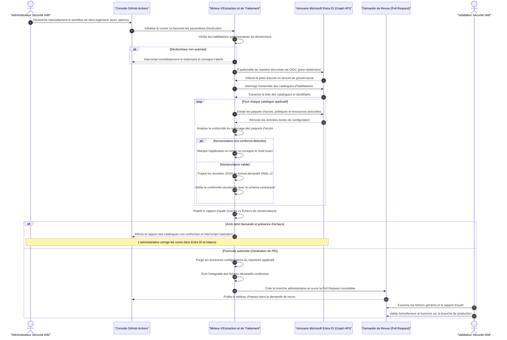

# Plan d'Implémentation Technique : Récupération de l'Existant (Reverse Engineering)
## Aspiration d'Entra ID & Traduction Déclarative GitOps
### Ardian — Architecture Cloud IAM & Sécurité des Accès

---

| Métadonnée | Valeur |
|:---|:---|
| **Client** | Ardian |
| **Projet** | Industrialisation & Automatisation GitOps de l'Identity Governance Entra ID |
| **Document** | Plan d'Implémentation Technique — Scénario d'Extraction & Rétro-Ingénierie ($T_0$) |
| **Rôle / Auteur** | Architecte Cloud IAM & DevOps Platform |
| **Destinataires** | Architecture Review Board, Équipe Sécurité IAM, Auditeurs Conformité |
| **Statut** | **Spécification Validée pour Implémentation** |
| **Version** | 1.0 |

---

## Synthèse du Besoin & Contraintes Opérationnelles

Le mécanisme de **Rétro-Ingénierie (*Reverse Engineering*)** a pour objectif d'aspirer la configuration réelle des habilitations existantes dans Microsoft Entra ID (catalogues, paquets d'accès, politiques d'assignation, groupes et rôles) et de la convertir automatiquement en fichiers déclaratifs YAML conformes au schéma Ardian v2.

### Les 3 Contraintes Incompressibles du Scénario
1. **Respect absolu des règles GitOps** : 1 application (catalogue) = 1 fichier déclaratif YAML unique.
2. **Conformité stricte à la nomenclature métier** : Seules les configurations respectant le standard de nommage `[Contexte/Sous-Application] [Niveau de Privilège] - [Environnement]` peuvent intégrer le référentiel.
3. **Caractère exceptionnel et déclenchement maîtrisé** : Ce processus n'a aucune vocation à tourner en continu. C'est une action unitaire (*One-off*) ou très occasionnelle (alignement initial à $T_0$ ou rattrapage majeur après incident).

---

## 1. Stratégie d'Intégration GitHub (Le Déclencheur)

### 1.1. Type de Déclencheur : Manuel Exclusif (`workflow_dispatch`)
Étant donné son impact potentiel sur l'ensemble du référentiel, ce scénario est implémenté sous la forme d'un workflow GitHub Actions dédié : **`.github/workflows/05-reverse-engineering.yml`**.

Ce workflow est configuré exclusivement avec l'événement **`on: workflow_dispatch`**, interdisant tout déclenchement automatique sur push, merge ou webhook.

### 1.2. Paramètres d'Entrée Configurables
Lors du lancement manuel dans la console GitHub Actions, l'administrateur renseigne les options suivantes :

| Paramètre | Type | Valeurs Possibles | Description & Comportement |
|:---|:---|:---|:---|
| **`execution_mode`** | `choice` | • `Audit (Dry-Run)` *(Défaut)*<br>• `Generate PR (Écriture)` | **Mode Audit** : Analyse l'annuaire et produit un rapport sans toucher à Git.<br>**Mode Génération** : Écrit les fichiers YAML et ouvre la Pull Request. |
| **`catalog_filter`** | `string` | `all` *(Défaut)* ou `<nom-catalogue>` | Permet de cibler l'ensemble de l'annuaire ou d'extraire un catalogue unique pour test. |
| **`on_nomenclature_error`** | `choice` | • `abort` *(Défaut — Sécurité stricte)*<br>• `skip_invalid` *(Import partiel)* | **`abort`** : Si un catalogue viole la nomenclature, tout le workflow s'arrête.<br>**`skip_invalid`** : Les catalogues non conformes sont ignorés et documentés dans le rapport ; seuls les catalogues 100% valides sont importés. |

### 1.3. Sécurisation & Restriction Strictes aux Administrateurs IAM
Pour empêcher qu'un contributeur non autorisé ne lance une réinitialisation de l'annuaire :
1. **Liaison à un Environnement GitHub Protégé** : Le job d'exécution est rattaché à l'environnement `production-admin`. Seuls les administrateurs désignés peuvent lancer des actions sur cet environnement.
2. **Contrôle d'Identité Automatisé en Entête de Workflow** :
   * Le workflow vérifie l'identité du déclencheur (`github.actor`).
   * Il valide son appartenance à l'équipe `@ardian/cloud-iam-team` via l'API GitHub.
   * Si l'utilisateur n'est pas membre de l'équipe IAM, le workflow s'interrompt immédiatement avec un code d'erreur (`exit 1`) et enregistre un événement d'audit de sécurité.

---

## 2. Choix Technologiques de l'Extraction

### 2.1. Analyse Comparative des Technologies Envisageables

```
┌────────────────────────────────────────────────────────────────────────────────────────────────┐
│                         ÉVALUATION DES TECHNOLOGIES D'EXTRACTION                               │
├────────────────────────────┬──────────────────────────────────┬────────────────────────────────┤
│ TECHNOLOGIE ENVISAGÉE      │ FORCES                           │ FAIBLESSES & VERDICT           │
├────────────────────────────┼──────────────────────────────────┼────────────────────────────────┤
│ Option A : Terraform       │ Génération native de blocs       │ ❌ **Inadapté** : Ne produit   │
│ Import (`-generate-config`)| HCL (.tf).                       │ que du HCL technique brut.     │
│                            │                                  │ Incapable de reconstituer nos  │
│                            │                                  │ abstractions métiers en YAML.  │
├────────────────────────────┼──────────────────────────────────┼────────────────────────────────┤
│ Option B : PowerShell      │ Commandlets Microsoft.Graph      │ 🟡 **Lourd** : Modules SDK     │
│ Graph SDK                  │ officielles disponibles.         │ longs à installer sur les      │
│                            │                                  │ runners Linux GitHub Actions.  │
├────────────────────────────┼──────────────────────────────────┼────────────────────────────────┤
│ Option C : Python avec API │ • Léger, rapide et natif.        │ 🟢 **CHOIX RETENU** :          │
│ Microsoft Graph REST       │ • Sérialisation PyYAML robuste.  │ Parfaite cohérence avec le     │
│ [CHOIX RETENU]             │ • Validation directe JSON Schema.│ reste de notre outillage CI.   │
└────────────────────────────┴──────────────────────────────────┴────────────────────────────────┘
```

#### Justification du Choix Python + Microsoft Graph API :
* **Cohérence de pile technique** : L'ensemble des scripts de parsing et de découverte de notre plateforme (`discover-catalogs.py`, `validate-schema.py`) est déjà écrit en Python 3.12.
* **Indépendance vis-à-vis de l'IaC** : Terraform n'intervient qu'en phase d'application. L'extraction initiale doit être totalement agnostique et lire la réalité brute du tenant.

---

### 2.2. Gestion Stricte de la Nomenclature & Règle Fail-Safe

Dans Entra ID, des paquets d'accès peuvent avoir été créés manuellement avec des noms arbitraires (ex: `"Acces-Provisoire-Stage"` ou `"VPN-Legacy-2022"`).

#### La Règle Fail-Safe par Application :
* Notre modèle impose la convention : `[Sous-Domaine / Contexte] [Niveau de Privilège] - [Environnement]`  
  *(Exemple : `SubApp Admin - Dev` ou `Salesforce Read Only - Prod`)*.
* Si dans un catalogue contenant 5 paquets d'accès, **un seul** paquet ne respecte pas cette convention :
  * **Le chargement de l'application en entier ÉCHOUE**.
  * Le catalogue est immédiatement retiré de la file d'exportation.

#### Les 2 Options Offertes à l'Administrateur dans le Bilan :
À l'issue de l'analyse, le système publie un **Tableau d'Audit Préalable** listant les catalogues conformes et les catalogues en échec :
1. **Option 1 (Correction dans Entra ID — Recommandée)** : L'administrateur consulte le motif exact de rejet, renomme le paquet d'accès directement dans le portail Microsoft Entra ID pour l'aligner sur la convention, puis relance le workflow en mode génération.
2. **Option 2 (Import Partiel avec Exclusion)** : Si l'administrateur a sélectionné `on_nomenclature_error: skip_invalid`, le système importe l'ensemble des catalogues conformes et consigne explicitement les applications rejetées dans le corps de la Pull Request pour traitement ultérieur.

---

## 3. Explication End-to-End (Étape par Étape)

Le processus d'extraction et de génération suit un enchaînement séquentiel en 6 étapes :

```
┌────────────────────────────────────────────────────────────────────────────────────────────────┐
│                        CINÉMATIQUE TECHNIQUE DU REVERSE ENGINEERING                            │
├────────────────────────────────────────────────────────────────────────────────────────────────┤
│ Étape 1 : Déclenchement manuel par l'administrateur (Options : Mode, Filtre, Tolérance)        │
│    ⬇️                                                                                          │
│ Étape 2 : Authentification OIDC Zero-Secret (Obtention du jeton Microsoft Graph éphémère)      │
│    ⬇️                                                                                          │
│ Étape 3 : Aspiration de l'annuaire (Extraction des Catalogues, Packages, Politiques et Rôles)  │
│    ⬇️                                                                                          │
│ Étape 4 : Décodage métier & Transformation des données JSON brutes en YAML v2 hiérarchique    │
│    ⬇️                                                                                          │
│ Étape 5 : Purge de l'arborescence declarations/apps/ et écriture des fichiers conformes        │
│    ⬇️                                                                                          │
│ Étape 6 : Création d'une branche administrative et ouverture automatique de la Pull Request    │
└────────────────────────────────────────────────────────────────────────────────────────────────┘
```

### Étape 3.1 : Déclenchement & Contrôle des Habilitations
* L'administrateur lance le workflow depuis l'onglet Actions de GitHub en sélectionnant ses paramètres (ex: `execution_mode: Generate PR`).
* Le runner GitHub Actions démarre, valide l'appartenance de l'utilisateur à l'équipe IAM et initialise l'environnement.

### Étape 3.2 : Authentification OIDC (Federated Credentials)
* Le runner utilise l'action officielle Azure Login configurée en OIDC.
* Aucun secret statique n'est utilisé. Un jeton d'accès JWT éphémère disposant des privilèges de lecture nécessaires (`EntitlementManagement.Read.All`, `Group.Read.All`) est obtenu auprès de Microsoft Entra ID.

### Étape 3.3 : Extraction des Données Brutes via Graph API
Le moteur Python interroge les points de terminaison REST suivants :
1. `GET /v1.0/identityGovernance/entitlementManagement/catalogs` : Récupère l'ensemble des catalogues (hors catalogues intégrés de base).
2. Pour chaque catalogue :
   * `GET /accessPackages` : Liste les paquets d'accès rattachés.
   * `GET /accessPackageAssignmentPolicies` : Récupère les règles d'approbation, durées d'attribution et revues d'accès.
   * `GET /accessPackageResourceRoleScopes` : Identifie les groupes Entra ID, applications d'entreprise, rôles applicatifs et sites SharePoint liés.

### Étape 3.4 : Transformation des Données en Format Déclaratif YAML v2
Pour chaque application, le moteur applique l'algorithme de reverse-parsing :
1. **Analyse du Nommage** : Une expression régulière décompose le `displayName` du paquet d'accès pour extraire les propriétés :
   * `context_subapp`
   * `privilege_level`
   * `env`
   * *Si l'expression régulière ne correspond pas ➔ Déclenchement de l'alerte de non-conformité et échec du catalogue.*
2. **Identification des Approbateurs** :
   * Analyse des étapes de validation (`approverStages`).
   * Résolution des identifiants d'utilisateurs ou de groupes en adresses email pour alimenter le champ `authorization_owners`.
   * Si aucune approbation n'est exigée (attribution directe), positionne `owner_only: true`.
3. **Mappage des Ressources** :
   * Convertit les types de ressources Graph en types déclaratifs Ardian (`EntraID Group`, `Application Role`, `Sharepoint Group`).
4. **Validation de Schéma** :
   * Chaque structure en mémoire est validée formellement contre le contrat JSON Schema `schemas/app-declaration.schema.json`.

### Étape 3.5 : Purge et Écriture des Fichiers Déclaratifs
Pour garantir qu'aucun fichier orphelin ou obsolète ne subsiste :
1. Le répertoire `declarations/apps/*.yaml` est nettoyé (les fichiers modèles `_example.yaml` et `.gitkeep` sont préservés).
2. Le moteur écrit l'ensemble des fichiers conformes au format `declarations/apps/<nom-application>.yaml`.

### Étape 3.6 : Ouverture de la Pull Request Consolidée
1. Le workflow crée une branche dédiée : `init/entra-import-<horodatage>`.
2. Il commite les fichiers générés avec un message d'audit traçant le run.
3. Il ouvre une **Pull Request officielle** ciblant `main` contenant :
   * Le compte-rendu d'exécution détaillé.
   * Le tableau récapitulatif des catalogues importés avec succès.
   * Le tableau des catalogues en échec (le cas échéant) avec le motif précis.
4. **Sas de Validation Humaine** : Aucun merge n'est automatique. L'équipe Sécurité IAM examine la Pull Request et procède à la fusion manuelle sur `main`.

---

## 4. Diagramme de Séquence Détaillé (Mermaid.js)

Conformément aux exigences de formalisation, ce diagramme utilise exclusivement des **descriptions fonctionnelles et descriptives** :



---

## 5. Synthèse des Garanties Opérationnelles

| Aspect | Garantie Apportée par le Design |
|:---|:---|
| **Sécurité d'Accès** | Déclenchement manuel impossible pour les utilisateurs standards (réservé exclusivement à l'équipe IAM par contrôle RBAC). |
| **Authentification Zero-Secret** | Utilisation exclusive de la fédération d'identité OIDC avec jetons d'accès éphémères. |
| **Intégrité de la Nomenclature** | Échec bloquant au niveau catalogue dès qu'un paquet d'accès dévie du format Ardian, empêchant toute pollution du référentiel Git. |
| **Zéro Fichier Orphelin** | Purge systématique et réécriture intégrale garantissant un alignement à 100% avec le tenant Entra ID à $T_0$. |
| **Validation Humaine Incontournable** | Les fichiers ne sont jamais poussés directement sur `main` : une Pull Request consolidée est systématiquement générée pour revue préalable. |
